# UI 设计规范

> **版本**：1.7
> **日期**：2026-09-01
> **状态**：待实现
> **关联文档**：[项目总览](./00-项目总览.md)、[核心战斗机制](./01-核心战斗机制.md)、[卡牌与词条系统](./02-卡牌与词条系统.md)、[状态效果系统](./03-状态效果系统.md)、[敌人系统](./04-敌人系统.md)、[Meta系统](./05-Meta系统.md)

---

## 目录

1. [设计哲学与视觉风格](#1-设计哲学与视觉风格)
2. [色彩系统](#2-色彩系统)
3. [字体规范](#3-字体规范)
4. [组件库](#4-组件库)
5. [界面清单与导航流程](#5-界面清单与导航流程)
6. [战斗界面布局](#6-战斗界面布局)
7. [Meta系统界面布局](#7-meta系统界面布局)
8. [卡牌相关界面布局](#8-卡牌相关界面布局)
9. [交互模式](#9-交互模式)
10. [动画指导原则](#10-动画指导原则)
11. [响应式与适配](#11-响应式与适配)

---

## 1. 设计哲学与视觉风格

### 1.1 核心关键词

| 关键词 | 释义 |
|---|---|
| **记忆殿堂** | 主视觉隐喻——古老图书馆/记忆宫殿。UI面板采用奶油纸底+暖金木质边框，圆角友好、造型圆润 |
| **明快休闲** | 浅色奶油基调+扁平卡通渲染，让卡牌类型色和战斗信息成为视觉焦点 |
| **信息分层** | 翻开后：类型色边带→卡名→词条胶囊→数字徽章，由远及近逐层展开；背面统一（通用卡背）不泄露类型 |
| **记忆可读** | 桌面4×4网格是绝对视觉中心，每张卡牌清晰可辨、位置明确 |

### 1.2 视觉风格参考

- **基调**：扁平休闲卡通（参照 Unity Asset Store「2D Characters - Casual Monsters」类休闲素材：干净矢量感圆胖轮廓、无描边、双色阶阴影、中饱和青绿/奶油/暖棕配色）+ 记忆殿堂奶油纸面板
- **卡牌**：类 Slay the Spire 的卡牌比例（约 7:10 竖卡），但桌面卡牌因需4×4排列，采用接近 3:4 的比例
- **面板**：浅色纸纹底色，粗圆角，暖金木边框，无做旧
- **特效**：魔法符文光效用于揭示等情报机制与标记增益

### 1.3 设计原则

1. **网格优先**：4×4卡牌网格是战斗界面的绝对中心，占据最大屏幕面积，不被其他UI遮挡
2. **状态一目了然**：敌人意图、行动条、血量等关键信息在玩家不移动视线的情况下可读
3. **记忆友好**：卡牌位置变化（换位/混乱）需有清晰视觉反馈，帮助玩家追踪
4. **操作极简**：核心操作仅"点击翻牌"，所有交互围绕这一个动作展开

---

## 2. 色彩系统

### 2.1 基础色板

| 用途 | 色名 | Hex | 说明 |
|---|---|---|---|
| 主背景 | 奶油纸 | `#F2EBD9` | 战斗/Meta界面主背景色 |
| 次背景 | 暖沙 | `#E6DCC2` | 面板、卡片底色 |
| 面板底色 | 浅羊皮纸 | `#EFE7D2` | 带纹理的面板底色 |
| 面板亮色 | 亮纸 | `#F8F2E3` | 悬浮/高亮面板 |
| 主文字 | 深可可 | `#3B3226` | 正文/标题文字 |
| 次文字 | 暖灰褐 | `#8A7A60` | 辅助/说明文字 |
| 分割线 | 暖金木 | `#C9A163` | 面板边框/分割线 |
| 辅助强调 | 静谧青 | `#7FB5AC` | 次级强调/选中态/进度底 |

### 2.2 强调色

| 用途 | 色名 | Hex | 说明 |
|---|---|---|---|
| 主强调 | 古金 | `#D4A857` | 标题、按钮、高亮元素 |
| 次强调 | 暖铜 | `#C87F3A` | 次级按钮、标签 |
| 危险/血量 | 暗红 | `#C73E3E` | 血量条、伤害数字 |
| 警告 | 橙红 | `#E87B35` | 警告提示 |
| 成功/治疗 | 翠绿 | `#5BA85B` | 治疗、正向反馈 |
| 格挡 | 银灰蓝 | `#7A8FA8` | 格挡值、护盾图标 |

### 2.3 卡牌类型色

依据 [卡牌与词条系统](./02-卡牌与词条系统.md#2-卡牌类型) 定义，类型色用于**卡面**的描边边带、卡名徽带与数字徽章（v1.17 起，类型胶囊取消）；卡背全类型统一（§4.4.2），不携带类型信息。

| 类型 | 主色 | Hex | 亮色（徽带/徽章） | Hex | 应用 |
|---|---|---|---|---|---|
| **攻击** | 暗红 | `#8B2C2C` | 亮红 | `#D44545` | 描边环/卡名徽带/伤害徽章 |
| **技能** | 深蓝 | `#2C4A8B` | 亮蓝 | `#4577D4` | 描边环/卡名徽带/格挡徽章 |
| **能力** | 深紫 | `#5B2C8B` | 亮紫 | `#9B45D4` | 描边环/卡名徽带/持续标签 |
| **诅咒** | 极暗 | `#1A1A1A` | 暗紫 | `#3A2A3A` | 描边环/卡名徽带 |

### 2.4 稀有度色

依据 [卡牌与词条系统](./02-卡牌与词条系统.md#1-卡牌结构) 中的稀有度定义。

| 稀有度 | 色名 | Hex | 应用方式 |
|---|---|---|---|
| **普通** | 银灰 | `#B0B0B0` | 卡面底部稀有度条 |
| **罕见** | 天蓝 | `#4A9CD4` | 卡面底部稀有度条 |
| **稀有** | 古金 | `#D4A857` | 卡面底部稀有度条 + 微光效 |
| **Boss** | 暗橙 | `#E87B35` | Boss遗物专用 |

> v1.17 起：卡名文字统一白字墨描边（位于类型色卡名徽带上），稀有度不再以卡名文字色标识，仅由卡面底部稀有度条承载（见 §4.4.3）；奖励/遗物界面的稀有度标签仍用本表色。

### 2.5 状态效果色

依据 [状态效果系统](./03-状态效果系统.md) 定义。

| 状态 | 图标底色 | Hex | 文字色 | Hex |
|---|---|---|---|---|
| **灼烧** | 橙红 | `#E84A20` | 白 | `#FFFFFF` |
| **冰冻** | 冰蓝 | `#3AC4E8` | 深蓝 | `#1A4A6B` |
| **中毒** | 毒绿 | `#7AC74F` | 深绿 | `#1E3A1E` |
| **护甲** | 银灰 | `#A8A8B8` | 深灰 | `#3A3A4A` |
| **易伤** | 紫红 | `#B83A8B` | 白 | `#FFFFFF` |
| **虚弱** | 暗黄绿 | `#8B9B3A` | 深绿 | `#2A3A1A` |

### 2.6 意图色

依据 [敌人系统·意图系统](./04-敌人系统.md#2-意图系统) 定义。

| 意图类型 | 图标色 | Hex | 说明 |
|---|---|---|---|
| **攻击** | 红 | `#C73E3E` | 剑/爪图标 |
| **蓄力** | 橙 | `#E87B35` | 蓄力光效图标 |
| **防御** | 蓝 | `#4A7AD4` | 盾图标 |
| **特殊** | 紫 | `#9B45D4` | 问号/特殊符号 |
| **狂暴** | 暗红脉动 | `#A82020` | 脉动红光 |

---

## 3. 字体规范

### 3.1 字体选择

| 用途 | 字体 | 备选 | 说明 |
|---|---|---|---|
| **标题/卡牌名称** | 思源宋体 Bold | Noto Serif SC Bold | 学术/古典气质 |
| **正文/效果描述** | 思源黑体 Regular | Noto Sans SC Regular | 清晰易读 |
| **数字** | DIN Bold / Oswald | 思源黑体 Bold | 血量/伤害/计数 |
| **小字/标签** | 思源黑体 Light | Noto Sans SC Light | 词条标签、辅助信息 |

### 3.2 字号层级

| 层级 | 用途 | 字号 | 字重 |
|---|---|---|---|
| H1 | 界面大标题 | 32px | Bold |
| H2 | 面板标题 | 24px | Bold |
| H3 | 卡牌名称 | 18px | Bold |
| Body | 效果描述/正文 | 14px | Regular |
| Caption | 词条标签/辅助 | 12px | Light |
| Number-L | 血量/大数字 | 28px | Bold |
| Number-M | 行动条/计数 | 18px | Bold |
| Number-S | 小计数器 | 14px | Regular |

> 以上字号基于 1920×1080 参考分辨率。Unity 中使用 TMP 时按 1px ≈ 1unit 缩放换算。

### 3.3 文字颜色规则

- 卡牌名称：白字墨描边（类型色卡名徽带上，v1.17 起）；稀有度由卡面底部稀有度条标识（§2.4）
- 效果文本：主文字色 `#3B3226`
- 数值（伤害/格挡/血量）：对应语义色（伤害=红，格挡=银蓝，治疗=绿）
- 词条标签：亮金色 `#E8B94F` + 半透明深可可底 rgba(59,50,38,0.8)

---

## 4. 组件库

### 4.1 通用面板（Panel）

```
┌─────────────────────────────────┐
│  面板标题                        │
│  ───────────────────────────    │
│  内容区域                        │
│                                 │
└─────────────────────────────────┘
```

| 属性 | 值 |
|---|---|
| 底色 | `#EFE7D2`（浅羊皮纸） |
| 边框 | 2px solid `#C9A163`（暖金木） |
| 圆角 | 8px |
| 内边距 | 16px |
| 标题区高度 | 32px |
| 阴影 | 外阴影 0 4px 12px rgba(74,58,32,0.25) |

### 4.2 按钮（Button）

**主按钮：**
```
┌──────────────────┐
│   重新铺满桌面     │
└──────────────────┘
```

| 属性 | 值 |
|---|---|
| 底色 | `#D4A857`（古金） |
| 文字 | `#3B3226`（深可可文字） |
| 圆角 | 6px |
| 内边距 | 8px 24px |
| 悬浮 | 亮度+10%，外发光 |
| 按下 | 亮度-10%，内缩2px |
| 禁用 | 灰度50%，不可点击 |

**次按钮：**
| 属性 | 值 |
|---|---|
| 底色 | `#F8F2E3`（亮纸） |
| 边框 | 1px solid `#C9A163` |
| 文字 | `#3B3226` |

**危险按钮：**
| 属性 | 值 |
|---|---|
| 底色 | `#C73E3E`（暗红） |
| 文字 | `#FFFFFF` |

> **v1.7 起按钮底图使用已发布九宫格资产**（`Assets/UI/buttons/`，960×208、切片边 52；家族风格：蜂蜜金/亮纸奶油/收敛暗红 + 深可可描边 + 双线金内框 + 四角金珠 + 上缘糖果高光带 + 底缘深色唇边）。上表色值为底图缺失时引擎侧的回退基线；悬浮/按下/禁用态由引擎调亮度与缩放实现（悬浮亮度+10%外发光、按下亮度-10%内缩2px仍适用）。

| 主按钮 `btn_primary` | 次按钮 `btn_secondary` | 危险按钮 `btn_danger` |
|---|---|---|
|  |  |  |

### 4.3 进度条（ProgressBar）

**血量条：**
```
  ████████████████░░░░░░  35/40
  │←────── 填充 ──────→│←空→│
```

| 属性 | 值 |
|---|---|
| 容器高 | 20px |
| 容器底色 | `#D9CDB0`（暖沙深） |
| 填充色（玩家） | `#C73E3E`（暗红） |
| 填充色（敌人） | `#8B2C2C`（暗红偏深） |
| 边框 | 1px solid `#C9A163` |
| 数字 | 跟随在条右侧，Number-M 格式 |

**行动条（ActionBar）：**
```
  ◯◯◯◯◯◯◯●●●  7/10
  │←── 已消耗 ──→│← 剩余 →│
```

| 属性 | 值 |
|---|---|
| 容器高 | 16px |
| 段数 | 敌人阈值（通常7~15） |
| 每段宽 | 16px，间距 2px |
| 已消耗段 | `#C73E3E`（红色实心圆） |
| 剩余段 | `#C9A163`（暖金木空心圆） |
| 阈值标记 | 最后一段放大 + 脉动光效 |

### 4.4 卡牌（Card）

卡牌是游戏最核心的UI组件。分**卡背**和**卡面**两种状态。

#### 4.4.1 卡牌尺寸

| 场景 | 宽 × 高 | 比例 | 说明 |
|---|---|---|---|
| 桌面卡牌 | 136 × 181 px | 3:4 | 4×4网格中的标准卡牌（左右结构下放大，见 §6.3） |
| 奖励选择 | 200 × 280 px | 5:7 | 卡牌奖励三选一中的大卡 |
| 牌库列表 | 60 × 80 px | 3:4 | 牌库查看中的缩略卡 |
| 悬浮预览 | 240 × 320 px | 3:4 | 鼠标悬停时的放大预览 |

#### 4.4.2 卡背（Face Down）——通用卡背

全类型共用的统一卡背（`cardback_universal.png`，静谧青"学者书斋"，2026-08-29 翻新）：


| 属性 | 值 |
|---|---|
| 底色 | 静谧青（中明度青绿，柔和明暗；背景殿堂尖拱暗纹） |
| 中央徽记 | 金色圆环内：金色发光记忆宝珠悬浮于奶油色摊开的书本上方，星点点缀 |
| 边框 | 金色细线边框 + 四角金点 |
| 圆角 | 6px |
| 类型信息 | **无**——背面不泄露类型（2026-08-25 起，四色卡背作废） |

#### 4.4.3 卡面（Face Up）

卡面为 v1.17「徽带卡框」版式（**精确布局规格以 [10·卡牌美术规格](./10-UI美术资源规格.md) §2.2 为正本**，本节为组件层摘要）：

```
┌─────────────────────┐
│  ▔▔ 火球术 ▔▔        │ ← 顶部类型色卡名徽带（卡名白字墨描边）
│    ┌─────────┐      │
│   ╱           ╲     │
│  │   拱形插画窗  │    │ ← 框体镂空（alpha=0），插画由引擎垫入
│   ╲           ╱     │
│    └─────────┘      │
│  ═══════════════    │ ← 窗台双金线规 + 类型色端珠
│  [配对] ⚔6 伤害     │ ← 「配对」胶囊 + 类型色数字徽章
│  [翻开] 获得2点格挡  │ ← 翻开效果短句（如有）
│   ～共鸣 · 🔥消耗    │ ← 词条胶囊（如有）
│  ▬▬▬▬▬▬▬▬▬         │ ← 稀有度色条
└─────────────────────┘
```

| 区域（480×640 基准） | 说明 |
|---|---|
| 卡名徽带 | 顶部类型亮色圆角带；卡名白字墨描边，引擎 TMP 渲染、不烘焙进贴图 |
| 拱形插画窗 | 框体贴图镂空（alpha<200 即窗形遮罩），插画由引擎 cover 等比垫入 |
| 窗台金线规 | 双金线+类型色端珠，分隔插画窗与效果区 |
| 配对效果行 | 「配对」胶囊（类型主色）+ 数字徽章 + 单位短字 |
| 翻开效果行 | 金色「翻开」胶囊 + 一行短句（无则隐藏） |
| 词条胶囊 | 色点+词条名小胶囊（无则隐藏；完整描述见悬浮预览） |
| 稀有度条 | 稀有度色 6px 圆角条 |
| 类型识别 | 类型色描边环（26px，四类型等粗）+ 徽带色承担；桌面小卡与悬浮预览同源可读 |

#### 4.4.4 能力牌卡面（特殊）

能力牌只有一种效果区域——**持续效果**（翻开触发，本场战斗持续生效；能力牌无`[翻开]`词条，见 [02·能力牌](./02-卡牌与词条系统.md)）：

```
┌─────────────────────┐
│ 全神贯注      ✦ 普通 │
│ ─────────────────── │
│ ♦ 持续效果           │  ← 菱形图标标记持续效果
│ 每翻开一张牌时，     │
│ 获得1点"专注"        │
│ ─────────────────── │
│        ♦            │  ← 能力牌标记
└─────────────────────┘
```

#### 4.4.5 卡牌特殊状态视觉

> 下表为卡牌的视觉覆盖表现：揭示/锁定机制已暂移待重新设计（2026-08-27），覆层资源保留；标记已重新设计为增益机制（2026-08-31 v1.20，视觉见表内标记行）；封锁/冰封/位置轮廓为敌人/遗物施加的特殊覆盖。主状态（背面/正面）的视觉见 §4.4.2 卡背与卡面设计。

| 状态 | 视觉表现 | 触发来源 |
|---|---|---|
| **标记（Marked）** | 背面：右上角金色「✦×N」层数角标（每层一枚✦，不显示牌面内容与具体增益项）；正面：对应数值旁显示金色「✦+N」加成标注（逐层标注） | 学者标记能力（v1.20 增益化重设计） |
| **揭示（Revealed）** | 卡背上叠加半透明卡面内容 + 蓝色光效 + 倒计时进度条 | 学者揭示能力 |
| **锁定（Locked）** | 正面卡牌右上角显示🔒图标 + 锁链边框装饰 | 学者锁定能力 |
| **封锁（Sealed）** | 卡牌上覆盖暗紫色封印符文 + 半透明遮罩 | 敌人封锁能力 |
| **冰封（Frozen）** | 卡牌上覆盖冰晶纹理 + 冰蓝色遮罩 | 敌人冰封能力 |
| **位置轮廓（Traced）** | 空格子或背面牌上显示淡淡的位置轮廓 | 遗物/能力效果 |

### 4.5 图标系统

#### 4.5.1 卡牌类型图标

| 类型 | 图标 | 色彩 |
|---|---|---|
| 攻击 | 交叉剑 ⚔ | `#D44545` |
| 技能 | 卷轴 📜 | `#4577D4` |
| 能力 | 菱形宝石 💎 | `#9B45D4` |
| 诅咒 | 骷髅 💀 | `#666666` |

#### 4.5.2 词条图标

| 词条 | 图标 | 色彩 | 说明 |
|---|---|---|---|
| `[翻开]` | 翻转箭头 ↻ | `#D4A857` | 触发型-翻开时 |
| `[翻回]` | 翻转箭头 ↺ | `#D4A857` | 触发型-翻回时 |
| `[丢弃]` | 下坠箭头 ↓ | `#D4A857` | 触发型-丢弃时 |
| `[离场]` | 消散 ✦ | `#D4A857` | 触发型-离场时 |
| `[入场]` | 入场 ★ | `#D4A857` | 触发型-首次翻开时 |
| `[消耗]` | 火焰消耗 🔥 | `#E84A20` | 效果型 |
| `[移除]` | 裂缝 ✕ | `#888888` | 效果型 |
| `[共鸣]` | 共鸣波纹 ～ | `#5BA85B` | 匹配型 |
| `[剑]` | 剑 ⚔ | `#5BA85B` | 匹配型 |
| `[盾]` | 盾 🛡 | `#5BA85B` | 匹配型 |
| `[顽固(x)]` | 岩石壁垒 ⛰ | `#4577D4` | 效果型-抵挡x次离场，显示剩余次数 |
| `[隐秘]` | 面具 🎭 | `#8E7CC3` | 效果型-被丢弃时触发基础效果 |
| `[迅速]` | 闪电 ⚡ | `#E8C23A` | 效果型-翻开不加行动条 |

#### 4.5.3 意图图标

| 意图 | 图标 | 说明 |
|---|---|---|
| 攻击 | 剑/爪 | 红色，显示伤害数值 |
| 蓄力 | 蓄力光球 | 橙色，脉动效果 |
| 防御 | 盾牌 | 蓝色，显示护甲数值 |
| 特殊 | 问号/能力图标 | 紫色，显示能力名 |
| 狂暴 | 脉动红眼 | 暗红脉动 |

#### 4.5.4 状态效果图标

| 状态 | 图标 | 底色 | 说明 |
|---|---|---|---|
| 灼烧 | 火焰 | 橙红 | 显示层数 |
| 冰冻 | 雪花 | 冰蓝 | 显示层数 |
| 中毒 | 毒瓶/气泡 | 毒绿 | 显示层数 |
| 护甲 | 盾形 | 银灰 | 显示护甲值 |
| 易伤 | 裂痕 | 紫红 | 显示持续回合数 |
| 虚弱 | 下箭头 | 暗黄绿 | 显示持续回合数 |

### 4.6 数字弹出（FloatingText）

| 类型 | 颜色 | 字号 | 动画 |
|---|---|---|---|
| 伤害 | `#C73E3E` | 24px Bold | 上浮+淡出，1.0s |
| 格挡获得 | `#7A8FA8` | 20px Bold | 上浮+淡出，0.8s |
| 治疗 | `#5BA85B` | 20px Bold | 上浮+淡出，0.8s |
| 行动条增加 | `#E87B35` | 16px Bold | 向行动条方向飞入，0.5s |
| 专注获得 | `#D4A857` | 16px Bold | 上浮+淡出，0.6s |

### 4.7 遗物图标

| 类型 | 尺寸 | 说明 |
|---|---|---|
| 遗物栏图标 | 40×40 px | 圆形边框，稀有度色边线 |
| 悬浮预览 | 200×auto | 弹出面板显示名称+效果 |

遗物栏：
```
 ┌──┐ ┌──┐ ┌──┐ ┌──┐
 │🔮│ │📦│ │📜│ │💎│
 └──┘ └──┘ └──┘ └──┘
```

---

## 5. 界面清单与导航流程

### 5.1 界面清单

| 编号 | 界面 | 类型 | 说明 |
|---|---|---|---|
| S01 | 主菜单 | 全屏 | 开始游戏/角色选择/设置/退出 |
| S02 | 角色选择 | 全屏 | 选择角色，查看被动和初始牌库 |
| S03 | 战斗界面 | 全屏 | 核心战斗，4×4卡牌网格 |
| S04 | Meta地图 | 全屏 | 节点地图，路径选择 |
| S05 | 卡牌奖励 | 模态 | 战斗胜利后三选一 |
| S06 | 牌库查看 | 模态/全屏 | 查看当前牌库构成（run 级牌区，不受战斗影响）；计数为库内单份，战斗中每张×2（见 §8.2.1） |
| S07 | 商店 | 全屏 | 购买卡牌/遗物/移除卡牌 |
| S08 | 篝火 | 全屏 | 回血或升级卡牌 |
| S09 | 事件 | 全屏 | 随机事件，选择选项 |
| S10 | Boss遗物奖励 | 模态 | 三选一Boss遗物 |
| S11 | 胜利/失败 | 全屏 | Run结束结算 |
| S12 | 暂停菜单 | 模态 | 暂停/设置/退出 |
| S13 | 设置 | 模态 | 音量/画质/按键 |

**S01 主菜单示意图**（程序合成，`ui_mockup.py`；字标字体为雅黑近似，正式实现按 §3 用思源宋体；徽标=记忆宝珠+摊开书本+小金冠，与通用卡背徽记同家族）：

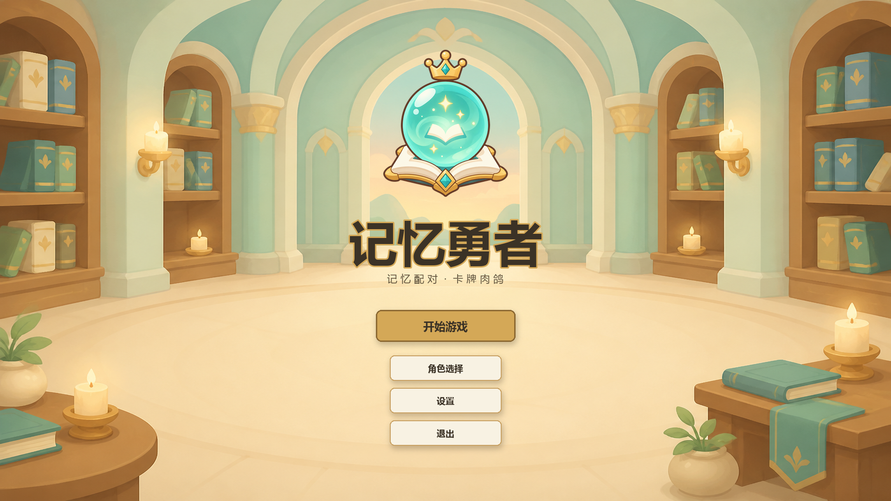

### 5.2 导航流程图

```
S01 主菜单
  ├─→ S02 角色选择
  │     └─→ S04 Meta地图（第1章）
  │           ├─→ S03 战斗界面
  │           │     ├─→ (胜利) S05 卡牌奖励 → S04
  │           │     ├─→ (Boss击杀) S10 Boss遗物奖励 → S04（下一章）
  │           │     └─→ (失败) S11 失败界面
  │           ├─→ S07 商店 → S04
  │           ├─→ S08 篝火 → S04
  │           ├─→ S09 事件 → S04
  │           └─→ S03 战斗界面（Boss节点）
  │                 └─→ S10 Boss遗物 → S04（下一章或胜利）
  ├─→ S13 设置
  └─→ 退出

  任意界面 ─→ S12 暂停菜单（模态）
  任意界面 ─→ S06 牌库查看（模态，战斗中/地图中均可）
```

### 5.3 Meta地图节点流程

每章地图**自下而上**推进：底部为起点，顶部为章节 Boss；章节间从左到右衔接，第三章 Boss 战胜利后进入胜利界面。

```
章节1                    章节2                    章节3
┌──────────────┐        ┌──────────────┐        ┌──────────────┐
│     Boss     │        │     Boss     │        │     Boss     │ ─→ S11 胜利界面
│      │       │        │      │       │        │      │       │
│  事─战─篝─战 │        │  战─篝─战─事 │        │  篝─战─事─战 │
│   │  │  │  │ │        │   │  │  │  │ │        │   │  │  │  │ │
│  战─商─战─战 │   →    │  战─事─战─战 │   →    │  事─战─战─战 │
│   │  │  │  │ │        │   │  │  │  │ │        │   │  │  │  │ │
│  战─战─事─精 │        │  事─战─商─精 │        │  战─事─精─商 │
│      │       │        │      │       │        │      │       │
│     起点     │        │     起点     │        │     起点     │
└──────────────┘        └──────────────┘        └──────────────┘
```

### 5.4 其他界面示意图（S02/S11/S12/S13）

v1.5 起补齐；均为程序合成示意图（`ui_mockup.py`，规格见对应小节或下方说明）。

**S02 角色选择**（三列并列：学者可选·狂战士/术士待解锁形象设计，见 [05·角色系统]）：

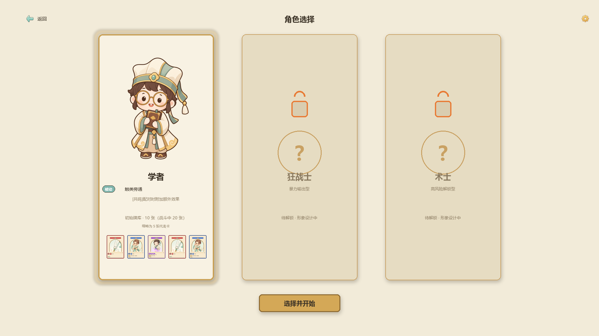

**S11 胜利结算**（Run 结束统计 + 再来一局/返回主菜单；失败界面同构，标题与统计项换失败口径）：

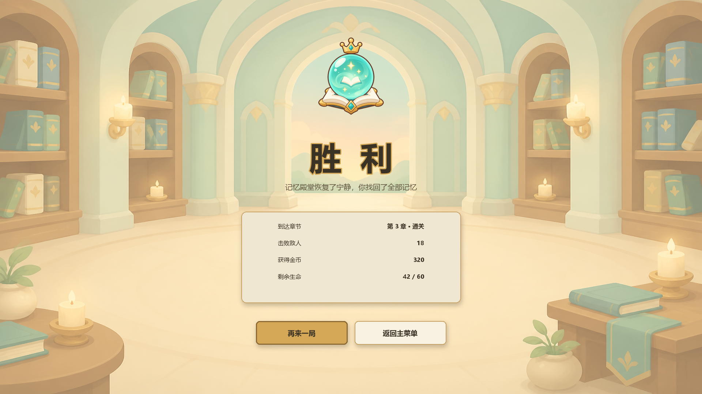

**S12 暂停菜单**（模态，规格见 §9.4）：

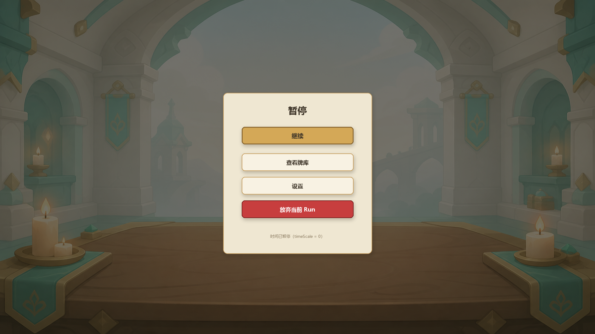

**S13 设置**（模态：音量/画质/按键）：

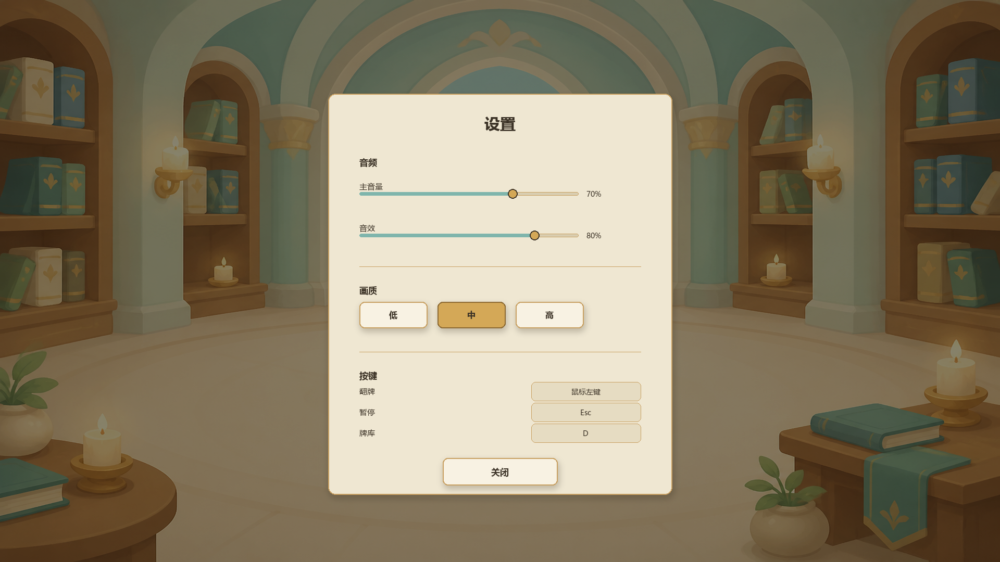

---

## 6. 战斗界面布局

**S03 战斗界面示意图**（程序合成 `ui_mockup.py`，1920×1080，**左右结构**：左=玩家牌桌（4×4 网格+牌桌托盘），右=敌人信息块+玩家状态横条；含悬停发光/标记角标 ✦×2/悬浮预览贴身弹出等交互态的静态表达，正面小卡文字按整卡缩放仅作示意——正式实现由 TMP 按显示尺寸渲染）：

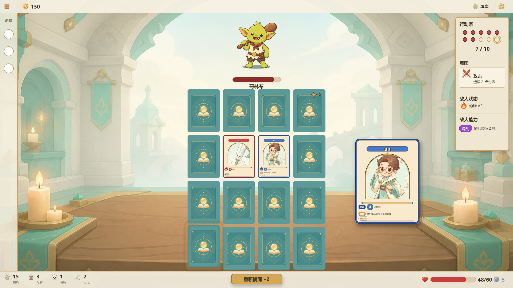

> 2026-09-01 布局重构（09 v1.6）：上下结构 → 左右结构。动因：①上下结构中敌人区与网格争抢同一条 968px 垂直空间，间距贴死；②敌人信息分裂两处（中央立绘+右侧面板）；③网格拿满左半区高度后卡面从 120×160 放大至 136×181，记牌可读性提升（记忆配对玩法核心成本是记牌面）。全局底栏取消（四堆计数并入牌桌托盘）；行动条自右侧面板移入敌人信息块（归属敌人蓄力计量，01 §6）；悬浮预览改贴身弹出。

### 6.1 总体布局（1920×1080 参考分辨率）

```
┌──────────────────────────────────────────────────────────────────┐
│ [☰菜单]  [💰150]                            [📦牌库]  [⚙设置]      │ 顶栏 48px
├──────┬───────────────────────────────────┬───────────────────────┤
│      │                                   │                       │
│ 遗物  │   ┌────┐ ┌────┐ ┌────┐ ┌────┐   │     敌人立绘（大）      │
│ 竖栏  │   │ 🂠  │ │ 🂠  │ │ 🂠  │ │ 🂠  │   │     ~376×400          │
│ 64px │   └────┘ └────┘ └────┘ └────┘   │                       │
│ 通高  │   ┌────┐ ┌────┐ ┌────┐ ┌────┐   │   哥林布               │
│      │   │ 🂠  │ │ 🂠  │ │ 🂠  │ │ 🂠  │   │   ═█████████░░ 35/40  │
│ 🔮   │   └────┘ └────┘ └────┘ └────┘   │   ⚡行动条 ●●●●●●●○○○   │
│ 📦   │   ┌────┐ ┌────┐ ┌────┐ ┌────┐   │   7/10                 │
│ 📜   │   │ 🂠  │ │ 🂠  │ │ 🂠  │ │ 🂠  │   │   ⚔意图：攻击 8        │
│      │   └────┘ └────┘ └────┘ └────┘   │   🔥灼烧×2 [混乱]       │
│      │   ┌────┐ ┌────┐ ┌────┐ ┌────┐   ├───────────────────────┤
│      │   │ 🂠  │ │ 🂠  │ │ 🂠  │ │ 🂠  │   │   ❤ 48/60    🛡 5     │
│      │   └────┘ └────┘ └────┘ └────┘   │  （玩家状态横条）        │
│      │                                   │                       │
│      │ [📦15][🗑3][💀1][🧠2] [🔄铺满+2]   │                       │
│      │ （牌桌托盘，与网格同宽对齐）          │                       │
└──────┴───────────────────────────────────┴───────────────────────┘
```

### 6.2 区域定义

| 区域 | 位置 | 尺寸 | 内容 |
|---|---|---|---|
| **顶栏** | 顶部全宽 | 1920 × 48px | 菜单按钮、金币、牌库按钮、设置（遗物栏由左侧竖条承担，顶栏不重复） |
| **左侧遗物栏** | 左侧 | 64 × 1032px（通高） | 遗物图标竖排列表 |
| **卡牌网格** | 左半区（牌桌侧核心） | 4×4，每格136×181，间距14px | 4列×4行=16张桌面卡牌 |
| **牌桌托盘** | 网格正下方，与网格同宽 | 586 × 64px | 抽牌/弃牌/消耗/记忆四堆计数、重新铺满按钮 |
| **敌人信息块** | 右半区上部 | ~420 × 820px | 敌人立绘、名字、血量条、行动条、意图卡、状态/能力 |
| **玩家状态横条** | 右半区底部 | 420 × 80px | 玩家血量、格挡 |

### 6.3 卡牌网格详细规格

```
  列间距: 14px
  ┌──────┐  ┌──────┐  ┌──────┐  ┌──────┐
  │      │14│      │14│      │14│      │   行间距: 14px
  │ 136  │px│ 136  │px│ 136  │px│ 136  │
  │ ×181 │  │ ×181 │  │ ×181 │  │ ×181 │
  │      │  │      │  │      │  │      │
  └──────┘  └──────┘  └──────┘  └──────┘
       14px                                总宽: 4×136 + 3×14 = 586px
  ┌──────┐  ┌──────┐  ┌──────┐  ┌──────┐   总高: 4×181 + 3×14 = 766px
  │      │14│      │14│      │14│      │
  ...
```

网格总尺寸：586 × 766 px。**不再全屏居中**——作为左半区（玩家牌桌侧）的核心：水平约 x 443~1029，顶部距顶栏约 36px，底边距牌桌托盘约 34px，托盘以下留底部呼吸区。

> 2026-09-01 卡面放大：120×160（间距12px）→ 136×181（间距14px）。左右结构后网格获得全高空间，卡面文字与插画的缩放可读性显著提升——记忆配对玩法的核心成本是记牌面，此为左右结构最大收益。

### 6.4 敌人信息区详细（右列上部）

```
┌─────────────────────────┐
│                         │
│     [敌人立绘/肖像]       │  ~376×400px（竖构图 contain）
│                         │
│         哥林布           │  名字 20px
│  ═████████████░░ 35/40  │  血量条 280×20px，数字条右侧
│                         │
│  ⚡ 行动条                │
│  ●●●●●●●○○○ 7/10        │  敌人蓄力计量（01 §6：翻牌+1，满则出手）
│                         │
│  ┌───────────────────┐  │
│  │ ⚔ 意图·攻击         │  │  意图卡 320×66px（白底卡）
│  │ 造成 8 点伤害       │  │
│  └───────────────────┘  │
│                         │
│  🔥 灼烧 ×2              │  状态行
│  [混乱] 随机交换 2 张     │  能力行
└─────────────────────────┘
```

自上而下动线：立绘 → 名字/血量 → 行动条（蓄力到哪了）→ 意图（下次出手是什么）→ 状态/能力——敌人相关信息聚合于一块，翻牌决策时单侧扫视即可（对应 §1 设计原则「状态一目了然」）。

### 6.5 玩家状态横条详细（右列底部）

```
┌─────────────────────────────┐
│  ❤ ████████████████░ 48/60   🛡 5  │  420×80px 面板
└─────────────────────────────┘
```

| 元素 | 尺寸 | 说明 |
|---|---|---|
| 玩家血量 | 图标 + 血量条 180×20px + 数字 | 红色血量条 + "48/60" |
| 玩家格挡 | 盾图标 + 数字 | 银蓝色，"🛡 5" |

> 2026-09-01：原 §6.5「右侧信息面板」（行动条/意图/敌人状态/能力集中栏）已并入 §6.4 敌人信息块；玩家血量/格挡自全局底栏移入本横条。

### 6.6 牌桌托盘详细（网格正下方）

```
┌───────────────────────────────────────────────┐
│ [📦15]  [🗑3]  [💀1]  [🧠2]    [🔄重新铺满 +2]  │
└───────────────────────────────────────────────┘
  四堆计数（左段）                主按钮（右段，金色+外晕）
```

| 元素 | 尺寸 | 说明 |
|---|---|---|
| 抽牌堆计数 | 28px 图标 + 文字 | 点击可展开抽牌堆列表（背面朝下） |
| 弃牌计数 | 28px 图标 + 文字 | 点击可展开弃牌堆列表 |
| 消耗计数 | 28px 图标 + 文字 | 点击可展开消耗堆列表 |
| 记忆堆计数 | 28px 图标 + 文字 | 点击可展开记忆堆列表（按触发顺序排列，牌本体不动，见 [01·牌区系统](./01-核心战斗机制.md#93-记忆堆记录规则)） |
| 重新铺满按钮 | 190×40px | 主按钮样式（金色 + 外发光），显示"+2"代价 |

托盘与网格同宽（586px）对齐，牌桌操作就近。> 2026-09-01：原全局底栏（1920×64px）取消，职能拆分——四堆计数并入本托盘，玩家血量/格挡移入右列玩家状态横条（§6.5）。

### 6.7 卡牌悬浮预览

鼠标悬浮在**正面朝上的卡牌**上时，弹出放大预览：

```
                    ┌─────────────────────┐
                    │ 火球术         ⚔ 普通 │
                    │ ─────────────────── │
                    │                     │
                    │   造成 6 点伤害      │
                    │                     │
                    │ ─────────────────── │
                    │ [共鸣]              │
                    └─────────────────────┘
```

预览卡尺寸：240 × 320 px，出现延迟 200ms，**贴身弹出**——紧邻被悬停卡（约 20px 间隙）并跟随鼠标，不单独划分预览区域。

### 6.8 战斗中的特殊UI状态

#### 6.8.1 揭示效果

```
┌─────────────────┐
│ ┌─────────────┐ │  ← 半透明蓝色遮罩
│ │  火球术      │ │  ← 卡面内容半透明显示
│ │  造成6伤害   │ │
│ │             │ │
│ └─────────────┘ │
│      3.0s       │  ← 倒计时进度条
│  ████████░░░░   │
└─────────────────┘
```

#### 6.8.2 标记效果

```
┌─────────────────┐   ┌─────────────────┐
│ ┌─────────────┐ │   │ ┌─────────────┐ │
│ │  (卡背)     │ │   │ │  打击       │ │ ← 翻开后：对应数值
│ │             │ │   │ │  6伤害 ✦+1 │ │   旁显示金色「✦+N」
│ │             │ │   │ │             │ │   加成标注（逐层）
│ └─────────────┘ │   │ └─────────────┘ │
│           ✦×2   │   │           ✦×2   │
└─────────────────┘   └─────────────────┘
      （背面）               （正面）
```

> v1.20 重设计：标记为增益机制——落点随机（优先有增益数值的牌，全无才纯随机），
> 每层随机一项基础效果数值临时+1，配对结算时生效。
> 背面角标只显示层数，不显示内容与具体增益项（情报不泄露，情报职能归揭示）；
> 翻开为正面后，卡面在对应数值旁逐层显示加成标注。

#### 6.8.3 全局揭示（目录/图书馆）

所有背面牌同时显示半透明内容，屏幕边缘有蓝色光效脉动。全局揭示持续期间屏幕略微变暗以突出卡牌内容。

#### 6.8.4 换位/混乱动画

被交换的两张牌沿弧线路径移动到对方位置，移动时间 0.5s，移动过程中带有紫色拖尾光效。

---

## 7. Meta系统界面布局

### 7.1 Meta地图界面（S04）

**示意图**（程序合成 `ui_mockup.py`；金线=已走路径、浅色节点=已通过、节点形状/颜色按下方节点类型表）：

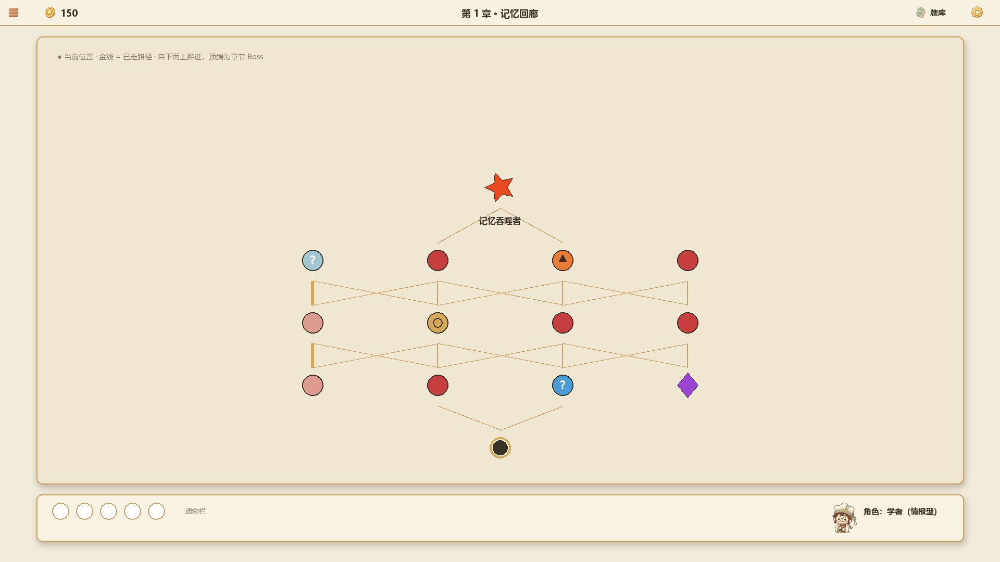

```
┌──────────────────────────────────────────────────────────────────┐
│ [←返回]  第1章 - 记忆回廊          [💰150]  [📦牌库]  [⚙设置]     │
├──────────────────────────────────────────────────────────────────┤
│                                                                  │
│           ★ Boss                                                │
│            |                                                    │
│           ○ 战斗                                                │
│          /   |   \                                              │
│     ○ 战斗  ○ 事件   ○ 战斗                                     │
│      |  /   \  |    \                                           │
│     ○ 篝火  ○ 商店    ○ 精英                                    │
│      |  /   \ |                                                  │
│     ○ 战斗   ○ 事件                                             │
│          \ /                                                    │
│           ● 起点                                                │
│                                                                  │
│  ● = 当前位置   ○ = 可选下一节点   已通过节点变暗                 │
├──────────────────────────────────────────────────────────────────┤
│ [遗物栏: 🔮📦📜💎○]    [角色: 学者]                               │
└──────────────────────────────────────────────────────────────────┘
```

地图**自下而上**推进：底部为起点（● 当前位置），玩家逐层向上选择路径，顶端为章节 Boss。

| 节点类型 | 图标 | 颜色 | 说明 |
|---|---|---|---|
| 战斗 | 圆形 | `#C73E3E` | 红色实心圆 |
| 精英 | 菱形 | `#9B45D4` | 紫色菱形 |
| 商店 | 金币图标 | `#D4A857` | 金色 |
| 篝火 | 火焰图标 | `#E87B35` | 橙色 |
| 事件 | 问号图标 | `#4A9CD4` | 蓝色 |
| Boss | 星形 | `#E84A20` | 大号红橙色 |

节点大小：40×40px。连线：2px solid `#C9A163`，可选路径高亮为 `#D4A857`。

### 7.2 商店界面（S07）

**示意图**（程序合成 `ui_mockup.py`；遗物徽记为简笔占位，真遗物图标批量后替换）：

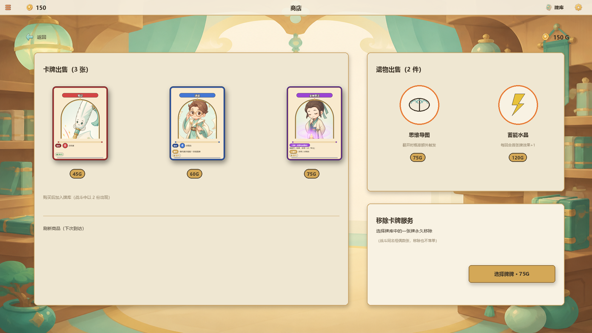

```
┌──────────────────────────────────────────────────────────────────┐
│  [←返回]  商店                              [💰 150 Gold]        │
├────────────────────────────────────┬─────────────────────────────┤
│                                    │                             │
│  📜 卡牌出售 (3张)                 │  🔮 遗物出售 (2件)          │
│  ┌──────┐ ┌──────┐ ┌──────┐      │  ┌──────┐ ┌──────┐         │
│  │ 卡牌1 │ │ 卡牌2 │ │ 卡牌3 │      │  │遗物1  │ │遗物2  │         │
│  │      │ │      │ │      │      │  │ 75G  │ │120G  │         │
│  │ 45G  │ │ 60G  │ │ 75G  │      │  └──────┘ └──────┘         │
│  └──────┘ └──────┘ └──────┘      │                             │
│                                    │  ─────────────────────     │
│  ──────────────────────────        │                             │
│                                    │  ✂ 移除卡牌服务              │
│                                    │  [选择一张牌库中的牌移除]    │
│                                    │  费用: 75G                  │
│                                    │                             │
│                                    │                             │
└────────────────────────────────────┴─────────────────────────────┘
```

### 7.3 篝火界面（S08）

**示意图**（程序合成 `ui_mockup.py`；篝火为静态占位，实机为火焰动画）：

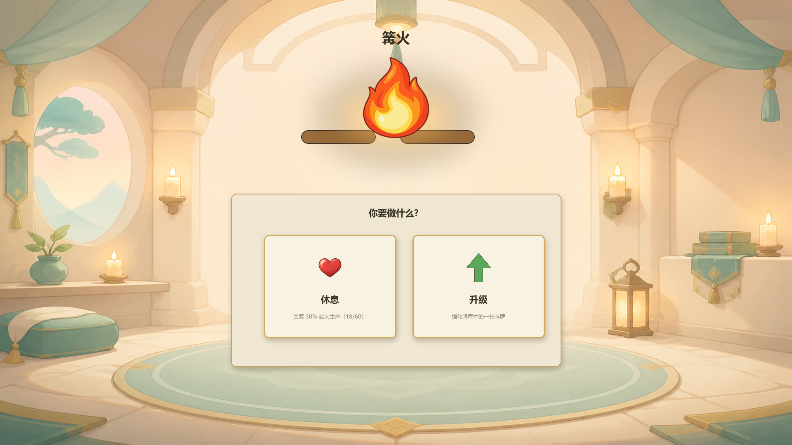

```
┌──────────────────────────────────────────────────────────────────┐
│                       篝火                                       │
│                                                                  │
│                    [🔥 火焰动画]                                  │
│                                                                  │
│           ┌──────────────────────────────┐                      │
│           │      ❓ 你要做什么？           │                      │
│           │                               │                      │
│           │  ┌─────────────┐ ┌─────────┐ │                      │
│           │  │  💚 休息     │ │ ⬆ 升级  │ │                      │
│           │  │  回复30%血量 │ │ 强化一张│ │                      │
│           │  │  (18/60)    │ │  卡牌   │ │                      │
│           │  └─────────────┘ └─────────┘ │                      │
│           └──────────────────────────────┘                      │
│                                                                  │
└──────────────────────────────────────────────────────────────────┘
```

| 选项 | 说明 |
|---|---|
| 休息 | 回复最大血量的30%（向下取整） |
| 升级 | 打开牌库列表，选择一张卡牌升级 |

### 7.4 事件界面（S09）

**示意图**（程序合成 `ui_mockup.py`；插图区为占位底纹，事件插画待美术批次）：

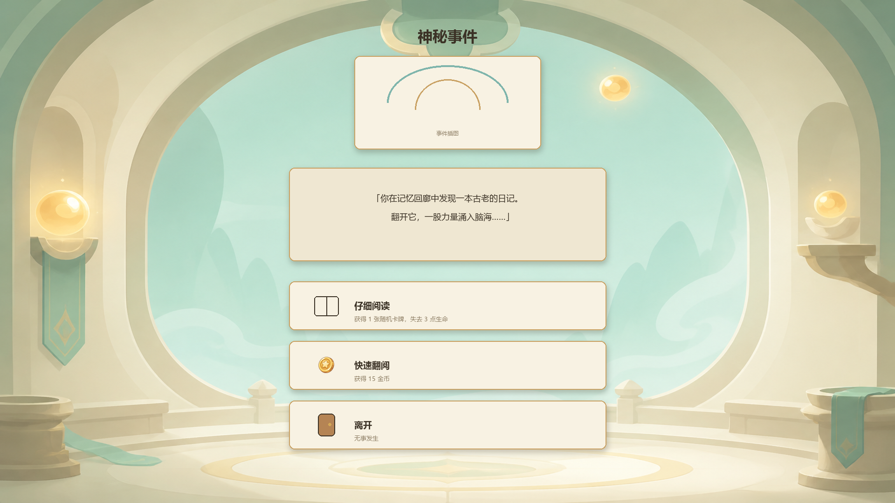

```
┌──────────────────────────────────────────────────────────────────┐
│                        神秘事件                                   │
│                                                                  │
│                 [事件插图区域 400×200]                            │
│                                                                  │
│           ┌──────────────────────────────────┐                   │
│           │                                   │                   │
│           │  "你在记忆回廊中发现一本古老的     │                   │
│           │   日记。翻开它，你感到一股力量     │                   │
│           │   涌入脑海..."                    │                   │
│           │                                   │                   │
│           └──────────────────────────────────┘                   │
│                                                                  │
│           ┌──────────────────────────────────┐                   │
│           │  [📖 仔细阅读]                    │                   │
│           │   获得1张随机卡牌，失去3点血量    │                   │
│           ├──────────────────────────────────┤                   │
│           │  [🏃 快速翻阅]                    │                   │
│           │   获得15金币                      │                   │
│           ├──────────────────────────────────┤                   │
│           │  [🚪 离开]                        │                   │
│           │   无事发生                        │                   │
│           └──────────────────────────────────┘                   │
│                                                                  │
└──────────────────────────────────────────────────────────────────┘
```

---

## 8. 卡牌相关界面布局

### 8.1 卡牌奖励界面（S05）

**示意图**（程序合成 `ui_mockup.py`；中卡上浮+金色发光为悬浮态静态表达）：

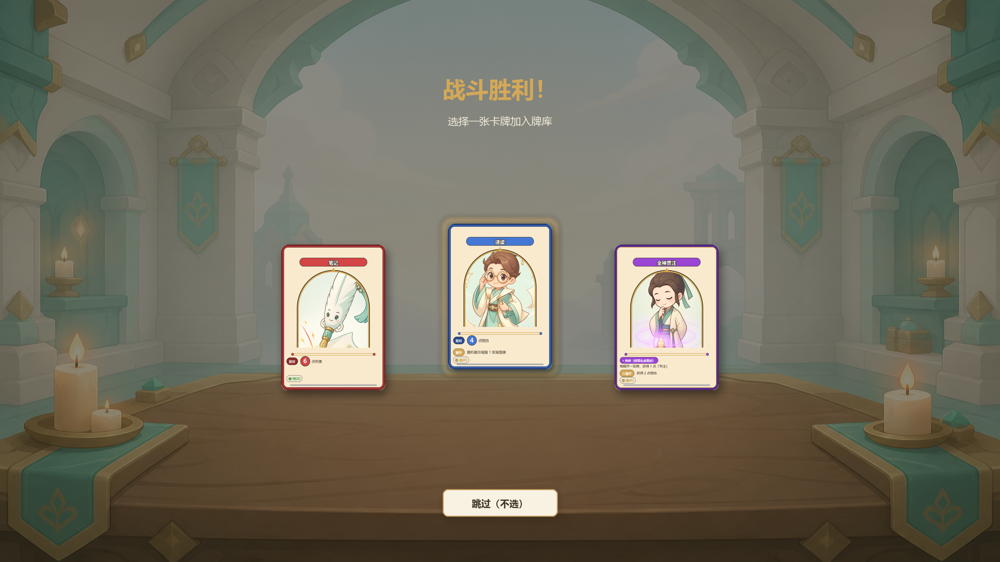

```
┌──────────────────────────────────────────────────────────────────┐
│                   战斗胜利！                                      │
│              选择一张卡牌加入牌库                                  │
│                                                                  │
│    ┌──────────┐    ┌──────────┐    ┌──────────┐                │
│    │          │    │          │    │          │                │
│    │  考据    │    │  目录    │    │  摘要    │                │
│    │ ⚔ 攻击   │    │ 📜 技能  │    │ 📜 技能  │                │
│    │          │    │          │    │          │                │
│    │ 造成7伤害│    │ 获得5格挡│    │ 3伤+3格挡│                │
│    │          │    │          │    │          │                │
│    │[离场]    │    │[翻开]    │    │          │                │
│    │揭示2张牌 │    │揭示全部  │    │          │                │
│    │          │    │ 3秒      │    │          │                │
│    │  普通    │    │  普通    │    │  普通    │                │
│    └──────────┘    └──────────┘    └──────────┘                │
│                                                                  │
│                    [ 跳过（不选）]                                │
└──────────────────────────────────────────────────────────────────┘
```

三张卡牌水平排列，间距 40px。每张卡牌 200×280px。悬浮时上浮 10px + 发光。奖励获取一律单张：库内 1 张 = 战斗中 2 份（见 [05·牌库系统](./05-Meta系统.md#2-牌库系统)），选卡界面无需展示份数。

### 8.2 牌库查看界面（S06）

**示意图**（程序合成 `ui_mockup.py`；计数口径见 §8.2.1——缩略卡为各类型代表卡）：

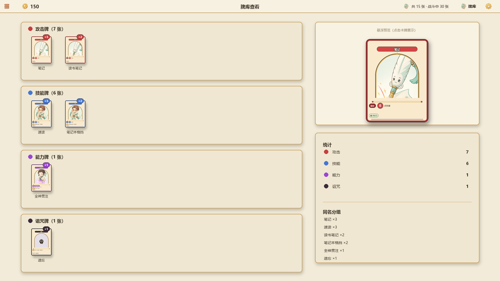

```
┌──────────────────────────────────────────────────────────────────┐
│  [←返回]  牌库查看                            [📦 共15张]        │
├────────────────────────────────────┬─────────────────────────────┤
│                                    │                             │
│  攻击牌 (7张)                      │  ┌─────────────────────┐   │
│  ┌────┐ ┌────┐ ┌────┐ ┌────┐    │  │                     │   │
│  │笔记│ │笔记│ │笔记│ │读书│    │  │   悬浮预览          │   │
│  │ ×3 │ │    │ │    │ │笔记│    │  │   （点击卡牌时       │   │
│  └────┘ └────┘ └────┘ └────┘    │  │    展示大图+详情）   │   │
│                                    │  │                     │   │
│  技能牌 (6张)                      │  └─────────────────────┘   │
│  ┌────┐ ┌────┐ ┌────┐            │                             │
│  │速读│ │速读│ │笔记│            │  统计：                     │
│  │ ×3 │ │    │ │本格│            │  攻击: 7  技能: 6           │
│  └────┘ └────┘ └────┘            │  能力: 1  诅咒: 1           │
│  ┌────┐ ┌────┐ ┌────┐            │                             │
│  │笔记│ │全神│ │    │            │  同名分组：                 │
│  │本格│ │贯注│ │    │            │  笔记 ×3  速读 ×3          │
│  └────┘ └────┘ └────┘            │  笔记本格挡 ×2              │
│                                    │                             │
│  能力牌 (1张)                      │                             │
│  ┌────┐                          │                             │
│  │全神│                          │                             │
│  │贯注│                          │                             │
│  └────┘                          │                             │
│                                    │                             │
│  诅咒牌 (1张)                      │                             │
│  ┌────┐                          │                             │
│  │遗忘│                          │                             │
│  └────┘                          │                             │
└────────────────────────────────────┴─────────────────────────────┘
```

### 8.2.1 牌库计数口径

S06 的计数为**库内（单份）张数**——战斗中每张以 2 份出现；顶栏总数旁可加副标题提示（如 `共15张 · 战斗中30张`），避免玩家误以为战斗配对密度与库内份数 1:1。

### 8.3 Boss遗物奖励（S10）

**示意图**（程序合成 `ui_mockup.py`；遗物徽记为简笔占位，真遗物图标批量后替换）：

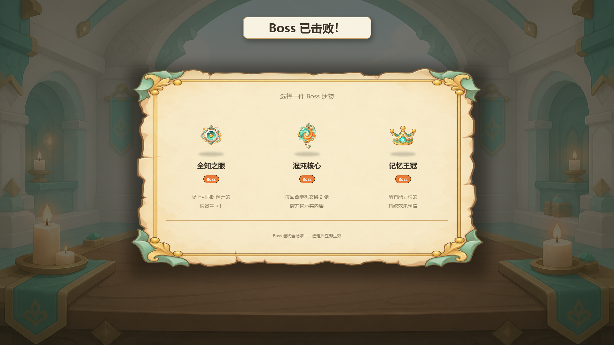

```
┌──────────────────────────────────────────────────────────────────┐
│                   Boss 已击败！                                   │
│              选择一件 Boss 遗物                                   │
│                                                                  │
│    ┌──────────────┐  ┌──────────────┐  ┌──────────────┐        │
│    │              │  │              │  │              │        │
│    │  [遗物图标]   │  │  [遗物图标]   │  │  [遗物图标]   │        │
│    │              │  │              │  │              │        │
│    │  全知之眼    │  │  混沌核心    │  │  记忆王冠    │        │
│    │   [Boss]     │  │   [Boss]     │  │   [Boss]     │        │
│    │              │  │              │  │              │        │
│    │ 场上可同时   │  │ 每回合开始时 │  │ 所有能力牌   │        │
│    │ 翻开的牌数   │  │ 随机交换2张  │  │ 持续效果翻倍 │        │
│    │ 量+1         │  │ 牌位置       │  │              │        │
│    │              │  │              │  │              │        │
│    └──────────────┘  └──────────────┘  └──────────────┘        │
│                                                                  │
└──────────────────────────────────────────────────────────────────┘
```

---

## 9. 交互模式

### 9.1 翻牌交互

翻牌是核心操作，需要明确的视觉反馈链：

```
鼠标悬停背面牌
  → 卡牌微上浮 4px + 边框发光（200ms延迟）
  
点击卡牌
  → 翻转动画（0.3s，3D旋转Y轴）
  → 卡面展示
  → [翻开]效果结算（如有）
  → 匹配判定
    → 匹配成功：两张牌发光 → 淡出消除（0.4s） → 粒子效果
    → 匹配失败：保持正面（等待下次翻牌）
  → 行动条 +1 动画
  
之前的正面牌
  → 翻回背面动画（0.3s）
```

### 9.2 悬浮预览交互

| 对象 | 触发 | 展示 |
|---|---|---|
| 正面朝上的卡牌 | 悬停 200ms | 放大预览卡（240×320） |
| 背面朝上的卡牌 | 悬停 200ms | 无预览（保持背面） |
| 标记的背面牌 | 悬停 200ms | 层数浮窗「标记×N」——不显示牌面内容与具体增益项 |
| 遗物图标 | 悬停 200ms | 遗物详情面板 |
| 状态效果图标 | 悬停 200ms | 状态说明tooltip |
| 敌人意图 | 悬停 200ms | 详细意图说明 |

### 9.3 重新铺满交互

```
点击"重新铺满"按钮
  → 确认弹窗："重新铺满桌面？行动条 +2"
  → [确认] [取消]
  → 确认后：
    → 当前桌面所有牌淡出（0.3s）
    → 新牌从抽牌堆飞入网格（0.5s，依次铺入）
    → 行动条 +2 动画
```

### 9.4 暂停菜单

```
ESC / 点击菜单按钮
  → 游戏暂停（时间缩放=0）
  → 模态面板弹出：
    [继续]
    [查看牌库]
    [设置]
    [放弃当前Run]
```

---

## 10. 动画指导原则

### 10.1 动画时长标准

| 类型 | 时长 | 缓动曲线 | 示例 |
|---|---|---|---|
| 微交互 | 100~150ms | ease-out | 按钮悬浮、图标高亮 |
| 标准过渡 | 200~300ms | ease-in-out | 面板展开/收起、预览出现 |
| 卡牌操作 | 300ms | ease-out | 翻牌动画 |
| 匹配消除 | 400ms | ease-in | 两张牌发光+淡出 |
| 换位/混乱 | 500ms | ease-in-out | 弧线路径移动 |
| 铺牌入场 | 50ms间隔 × 16 | ease-out | 依次飞入网格 |
| 数字弹出 | 1000ms | ease-out | 伤害/治疗数字上浮 |
| 行动条填充 | 300ms | ease-out | 段位逐个点亮 |

### 10.2 关键动画

#### 翻牌动画
- 3D旋转 Y轴 0°→180°，300ms
- 中间帧（90°）时切换卡背→卡面贴图
- 翻牌时卡牌轻微上浮（z轴+8px），翻完后回落

#### 匹配成功动画
1. 两张牌同时发光（白色外发光，200ms）
2. 卡牌内容上浮+放大（200ms）
3. 两牌向中点靠拢（150ms）
4. 淡出+粒子消散（200ms）
5. 效果数字弹出（伤害/格挡等）

#### 换位动画
- 两张牌沿弧线路径互换位置
- 路径中点向上弯曲（弧高≈40px）
- 移动期间紫色拖尾光效
- 到位后短暂高亮（100ms）

#### 揭示动画
- 蓝色光效从卡牌底部上升
- 卡面内容半透明淡入（200ms）
- 倒计时进度条从满到空
- 时间到后蓝色光效消散，内容淡出（200ms）

#### 行动条满→敌人行动
1. 行动条最后一段放大+红色脉动（200ms）
2. 行动条整体闪红（100ms）
3. 敌人行动动画（攻击/防御/特殊）
4. 行动条重置（段位逐个熄灭，300ms）

### 10.3 粒子效果

| 场景 | 粒子 | 颜色 | 数量 |
|---|---|---|---|
| 匹配消除 | 星尘消散 | 类型色 | 15~20 |
| 灼烧伤害 | 火花 | 橙红 | 8~10 |
| 中毒伤害 | 毒泡 | 毒绿 | 6~8 |
| 冰冻效果 | 冰晶 | 冰蓝 | 6~8 |
| 治疗 | 绿色光点 | 翠绿 | 10~12 |
| 获得格挡 | 银色碎片 | 银灰蓝 | 8~10 |
| 专注获得 | 金色光点 | 古金 | 3~5 |

---

## 11. 响应式与适配

### 11.1 目标分辨率

| 优先级 | 分辨率 | 比例 | 说明 |
|---|---|---|---|
| P0 | 1920×1080 | 16:9 | 主目标分辨率 |
| P1 | 2560×1440 | 16:9 | 2K，等比放大 |
| P2 | 1280×720 | 16:9 | 最小支持，等比缩小 |
| P3 | 1366×768 | ~16:9 | 笔记本常见分辨率 |

### 11.2 Unity适配策略

- 使用 Canvas Scaler，Reference Resolution = 1920×1080，Match = 0.5（Width/Height平均）
- 关键UI元素使用 Anchor 锚定到屏幕边缘
- 卡牌网格锚定左半区（牌桌侧核心），使用 AspectRatioFitter 保持比例
- 面板使用 Layout Group 自动排列子元素

### 11.3 安全区域

- 屏幕边缘保留 16px 安全区（UI不贴边）
- 4×4网格与右列（敌人信息块/玩家状态横条）之间保留至少 24px 间距
- 牌桌托盘与网格之间保留至少 16px 间距
