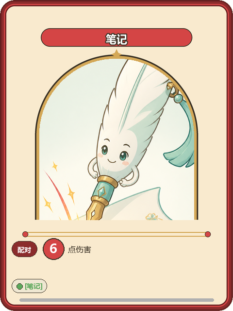

# UI 美术资源规格

> **版本**：1.15  
> **日期**：2026-09-05  
> （v1.13/v1.14 为 S09/S07 收官版——2026-09-02 提交时头部漏改，本次一并修正）  
> **状态**：待实现  
> **关联文档**：[UI设计规范](./09-UI设计规范.md)、[卡牌与词条系统](./02-卡牌与词条系统.md)、[状态效果系统](./03-状态效果系统.md)、[敌人系统](./04-敌人系统.md)、[遗物设计](./07-遗物设计.md)

---

## 目录

1. [色彩系统总表](#1-色彩系统总表)
2. [卡牌美术规格](#2-卡牌美术规格)
3. [图标资源清单](#3-图标资源清单)
4. [UI面板与边框规格](#4-ui面板与边框规格)
5. [字体规格](#5-字体规格)
6. [动画资源规格](#6-动画资源规格)
7. [粒子效果规格](#7-粒子效果规格)
8. [Unity导入设置](#8-unity导入设置)
9. [资源命名规范](#9-资源命名规范)
10. [资源清单汇总](#10-资源清单汇总)

---

## 1. 色彩系统总表

### 1.1 基础UI色

| 用途 | Hex | RGB | 用于 |
|---|---|---|---|
| 主背景 | `#F2EBD9` | 242, 235, 217 | 全局背景（奶油纸） |
| 次背景 | `#E6DCC2` | 230, 220, 194 | 面板底色（暖沙） |
| 面板底色 | `#EFE7D2` | 239, 231, 210 | 浅羊皮纸面板 |
| 面板亮色 | `#F8F2E3` | 248, 242, 227 | 悬浮面板（亮纸） |
| 主文字 | `#3B3226` | 59, 50, 38 | 正文（深可可） |
| 次文字 | `#8A7A60` | 138, 122, 96 | 辅助文字（暖灰褐） |
| 边框 | `#C9A163` | 201, 161, 99 | 面板边框（暖金木） |
| 辅助强调 | `#7FB5AC` | 127, 181, 172 | 次级强调/选中态（静谧青） |
| 古金 | `#D4A857` | 212, 168, 87 | 强调/标题 |
| 暖铜 | `#C87F3A` | 200, 127, 58 | 次强调 |
| 危险红 | `#C73E3E` | 199, 62, 62 | 血量/伤害 |
| 警告橙 | `#E87B35` | 232, 123, 53 | 警告 |
| 成功绿 | `#5BA85B` | 91, 168, 91 | 治疗/正向 |
| 格挡蓝 | `#7A8FA8` | 122, 143, 168 | 格挡/护盾 |


> v1.3（2026-08-25）：基础 UI 色随美术风格 v3（扁平休闲卡通，参照 LAYERLAB Casual Monsters）由暗色系调亮为奶油纸/暖金木明快底，并新增辅助强调静谧青；卡牌类型/状态/意图/稀有度等功能色不变（记忆信息分层锚点，样张已按其生成）。

### 1.2 卡牌类型色

| 类型 | 主色 Hex | 主色 RGB | 亮色 Hex | 亮色 RGB |
|---|---|---|---|---|
| 攻击 | `#8B2C2C` | 139,44,44 | `#D44545` | 212,69,69 |
| 技能 | `#2C4A8B` | 44,74,139 | `#4577D4` | 69,119,212 |
| 能力 | `#5B2C8B` | 91,44,139 | `#9B45D4` | 155,69,212 |
| 诅咒 | `#1A1A1A` | 26,26,26 | `#3A2A3A` | 58,42,58 |

> v1.4（2026-08-25）卡背改**通用卡背**、v1.17（2026-08-30）类型胶囊取消后，本表类型色用于卡面（描边环/卡名徽带/数字徽章）；原「卡背渐变」列作废。

### 1.3 稀有度色

| 稀有度 | Hex | RGB | 应用 |
|---|---|---|---|
| 普通 | `#B0B0B0` | 176,176,176 | 卡面底部稀有度条 |
| 罕见 | `#4A9CD4` | 74,156,212 | 卡面底部稀有度条 |
| 稀有 | `#D4A857` | 212,168,87 | 卡面底部稀有度条 + 微光 |
| Boss | `#E87B35` | 232,123,53 | Boss遗物专用 |

> v1.17 起：卡名文字统一白字墨描边（类型色徽带上），稀有度不以卡名文字色标识（布局见 §2.2）；奖励/遗物界面的稀有度标签仍用本表色。

### 1.4 状态效果色

| 状态 | 底色 Hex | 文字色 Hex | 图标建议 |
|---|---|---|---|
| 灼烧 | `#E84A20` | `#FFFFFF` | 火焰 🔥 |
| 冰冻 | `#3AC4E8` | `#1A4A6B` | 雪花 ❄️ |
| 中毒 | `#7AC74F` | `#1E3A1E` | 毒瓶/气泡 🧪 |
| 护甲 | `#A8A8B8` | `#3A3A4A` | 盾形 🛡️ |
| 易伤 | `#B83A8B` | `#FFFFFF` | 裂痕/靶心 |
| 虚弱 | `#8B9B3A` | `#2A3A1A` | 下箭头 ⬇️ |

### 1.5 意图色

| 意图 | Hex | RGB | 图标 |
|---|---|---|---|
| 攻击 | `#C73E3E` | 199,62,62 | 交叉剑/爪 |
| 蓄力 | `#E87B35` | 232,123,53 | 蓄力光球 |
| 防御 | `#4A7AD4` | 74,122,212 | 盾牌 |
| 特殊 | `#9B45D4` | 155,69,212 | 问号 |
| 狂暴 | `#A82020` | 168,32,32 | 脉动红眼 |

---

## 2. 卡牌美术规格

### 2.1 卡牌尺寸

| 用途 | 尺寸（px） | 比例 | 说明 |
|---|---|---|---|
| **卡牌资产（制作基准）** | **480×640** | 3:4 | 卡面/卡背/覆层统一按此尺寸制作 |
| 桌面卡牌（显示） | 136×181 | 3:4 | 4×4网格显示（左右结构下放大，见 09 §6.3） |
| 奖励选择（显示） | 210×280 | 3:4 | 大卡展示（v1.15 起等比修正，原 200×280/5:7） |
| 牌库缩略（显示） | 60×80 | 3:4 | 牌库列表 |
| 悬浮预览（显示） | 240×320 | 3:4 | 鼠标悬浮大图 |

> 卡牌整卡资产像素长宽定稿为 **480×640**（2026-08-25）。各显示场景由同一资产缩放。卡框发布资产为 **960×1280 程序生成分层版**（`frame_b_pipeline.py`，v1.17，2026-08-30）：**五层程序绘制**（L1 类型描边环（26px 源尺度规格、色锚定 10§1.2 类型色板，四类型等粗色准）→ L2 奶油卡面 → L3 宽拱窗（墨线→金饰→净底）→ L4 饰件（拱顶金星+窗台双金线规+类型色端珠）→ L5 顶部类型色卡名徽带）+ **拱形插画窗 alpha 洞按几何直接定义**（1.2px 羽化）；**四类型同一几何仅换色板，零漂移**。引擎接口：框体贴图 alpha<200 即窗形遮罩，插画 cover 等比裁贴垫入；文字全部由 UI 层（TMP）实时渲染，不烘焙进贴图。AI 整图管线（`roundify_card.py --compose-type`+拓扑暖环挖洞）为 v1.5–v1.16 历史口径，留作回退。

### 2.2 卡牌正面布局（v1.17 徽带卡框·插画主导）



> v1.17（2026-08-30）：卡框改**程序化分层生成**（`frame_b_pipeline.py`，四类型同一几何仅换色板）——方向 B「徽带宽窗」：类型色描边环 + 宽拱窗（金饰线+拱顶金星）+ 窗台双金线规（类型色端珠）+ **顶部类型色徽带 = 卡名铭牌位**；奶油铭牌胶囊与右上角类型胶囊**取消**（类型由徽带/描边环色承担）。发布资产 960×1280，拱窗 alpha 洞按几何直接定义（无需检测）。
> v1.5–v1.16（2026-08-29/30）：卡框为 AI 绘制"记忆殿堂拱窗"整图 + 分层合成/拓扑暖环挖洞（`roundify_card.py --compose-type`），历史口径留作回退；合成器 `card_frame_mockup.py`（v4，仅卡背效果图仍用）。
> v1.4（2026-08-25）：插画主导、数字徽章、词条胶囊取代 v1.3 文字分区版式（矩形插画窗版，已归档）。

| 区域 | 位置/尺寸（480×640） | 内容 |
|---|---|---|
| 卡名徽带 | 顶部 y≈58–96，类型亮色圆角带（x≈84–396） | 卡名（白字墨描边 22px Bold；**引擎 TMP 渲染，不烘焙**） |
| 拱形插画窗 | 宽拱窗 x≈72–408，拱顶 y≈112，拱底/窗台 y≈452 | **资产窗区镂空（alpha=0，alpha<200 即窗形遮罩）**：卡牌插画由引擎 cover 等比裁贴垫入，框体金饰压其上 |
| 窗台金线规 | y≈478–486 双金线，两端类型色珠 | 插画窗与效果区分隔 |
| 配对效果 | y≈496 起（金线规下） | 「配对」胶囊（类型主色）+ 类型色大数字徽章（Ø44）+ 单位短字（如 [6] 点伤害） |
| 翻开效果 | 配对行下方 | 金色「翻开」胶囊 + 一行短句（≤2 行） |
| 词条胶囊 | ≤584（金线规下） | 色点+词条名小胶囊（触发金/匹配绿/移除灰）；完整描述见悬浮预览 |
| 稀有度条 | y≈614（环内缘 y≈627 之上） | 稀有度色 6px 圆角条 |
| 类型识别 | 描边环 + 卡名徽带颜色（类型胶囊已取消） | 桌面小卡与悬浮预览同源 |

- 桌面 136×181 小卡只读**类型色边带 + 数字徽章**；完整文字在悬浮预览（240×320）由 TMP 按显示尺寸渲染，任何缩放保持清晰。
- 字号规格见 §5.3，为 1920×1080 显示字号，不随资产尺寸缩放。

### 2.3 卡背设计（v1.4：通用卡背，全类型共用）


- **统一卡背**：静谧青"学者书斋"底、金色细线边框+四角金点；中央金色圆环徽记内为**金色发光记忆宝珠悬浮于奶油色摊开的书本上方**，星点点缀、背景殿堂尖拱暗纹，对称构图，无文字。
- 资产：`cardback_universal.png`（发布版 1024×1365，3:4 圆角透明角，见 §2.1 口径）。
- **v1.5（2026-08-29）**：卡背视觉翻新为静谧青纹章方向（原深暖可可"旧书封"版归档 `ImageReview/_archived/2026-08-29/cardbacks/`）；通用卡背原则不变。
- **v1.3 及之前的四类型色卡背作废**——背面不泄露类型信息，类型识别移至卡面（§2.2 类型色边带+胶囊）；玩法影响见 [02-卡牌与词条系统 §2](./02-卡牌与词条系统.md#2-卡牌类型)。

### 2.4 能力牌正面（特殊）

能力牌插画窗与普通牌同款拱窗框（v1.5 起，窗高随框图），下方为**标签式**持续效果区（与 §2.2 布局语言一致；能力牌无`[翻开]`词条，仅持续效果一种，见 [02·能力牌](./02-卡牌与词条系统.md)）：

| 区域 | 标签 | 标签色 | 内容 |
|---|---|---|---|
| 持续效果 | ◆ 持续（翻开触发·本场战斗生效） | `#9B45D4`（紫） | ≤2 行短句 |

### 2.5 卡牌特殊状态覆层

> 覆层为卡牌的视觉覆盖表现：揭示/锁定机制已暂移待重新设计（2026-08-27），覆层资源保留；标记已重新设计为增益机制（2026-08-31 v1.20，覆层改为层数角标，见下行）；封锁/冰封/位置轮廓为特殊覆盖，叠加在主状态视觉之上。

| 状态 | 覆层规格 | 文件 |
|---|---|---|
| **标记** | 背面：右上角金色「✦×N」层数角标（✦ 24×24px，`#D4A857`，每层一枚，层多时合并为✦×N数字），不显示牌面内容；正面：对应数值旁金色「✦+N」加成标注（逐层，可引擎文字渲染复用✦素材） | `overlay_marked.png` |
| **揭示** | 蓝色半透明遮罩 `rgba(58,196,232,0.15)` + 蓝色边框 2px `#3AC4E8` | `overlay_revealed.png` |
| **锁定** | 右上角锁图标 24×24px + 锁链装饰边框 | `overlay_locked.png` |
| **封锁** | 暗紫色封印符文覆盖 + 半透明遮罩（opacity 0.4） | `overlay_sealed.png` |
| **冰封** | 冰晶纹理覆盖 + 冰蓝色遮罩 | `overlay_frozen.png` |
| **位置轮廓** | 淡白色轮廓线（opacity 0.15）仅显示位置 | `overlay_traced.png` |

---

## 3. 图标资源清单

### 3.1 卡牌类型图标（4个）

| 图标 | 文件名 | 尺寸 | 说明 |
|---|---|---|---|
| ⚔ 攻击 | `icon_type_attack.png` | 48×48 | 交叉剑，红色 |
| 📜 技能 | `icon_type_skill.png` | 48×48 | 卷轴，蓝色 |
| 💎 能力 | `icon_type_ability.png` | 48×48 | 菱形宝石，紫色 |
| 💀 诅咒 | `icon_type_curse.png` | 48×48 | 骷髅，灰色 |

### 3.2 词条图标（13个）

| 图标 | 文件名 | 尺寸 | 色彩 | 说明 |
|---|---|---|---|---|
| ↻ 翻开 | `icon_tag_flip.png` | 32×32 | `#D4A857` | 翻转箭头 |
| ↺ 翻回 | `icon_tag_flipback.png` | 32×32 | `#D4A857` | 反向翻转箭头 |
| ↓ 丢弃 | `icon_tag_drop.png` | 32×32 | `#D4A857` | 下坠箭头 |
| ✦ 离场 | `icon_tag_leave.png` | 32×32 | `#D4A857` | 消散星 |
| ★ 入场 | `icon_tag_enter.png` | 32×32 | `#D4A857` | 入场星 |
| 🔥 消耗 | `icon_tag_consume.png` | 32×32 | `#E84A20` | 火焰消耗 |
| ✕ 移除 | `icon_tag_remove.png` | 32×32 | `#888888` | 裂缝 |
| ～ 共鸣 | `icon_tag_resonance.png` | 32×32 | `#5BA85B` | 共鸣波纹 |
| ⚔ 剑 | `icon_tag_sword.png` | 32×32 | `#5BA85B` | 剑 |
| 🛡 盾 | `icon_tag_shield.png` | 32×32 | `#5BA85B` | 盾 |
| ⛰ 顽固 | `icon_tag_stubborn.png` | 32×32 | `#4577D4` | 岩石壁垒，显示剩余次数 |
| 🎭 隐秘 | `icon_tag_hidden.png` | 32×32 | `#8E7CC3` | 面具/阴影 |
| ⚡ 迅速 | `icon_tag_swift.png` | 32×32 | `#E8C23A` | 闪电 |

> 词条图标均未实际生成，以本表为生成规格（与 [09·词条图标](./09-UI设计规范.md#452-词条图标) 对齐）。旧规格 `icon_tag_exhaust_trigger.png`（消除，已更名离场）、`icon_tag_note.png`（笔记，词条已移除）、`icon_tag_sword_shield.png`（剑盾合一，已拆分）作废。

### 3.3 状态效果图标（6个）

| 图标 | 文件名 | 尺寸 | 底色 | 说明 |
|---|---|---|---|---|
| 🔥 灼烧 | `icon_status_burn.png` | 40×40 | `#E84A20` | 火焰，显示层数 |
| ❄️ 冰冻 | `icon_status_freeze.png` | 40×40 | `#3AC4E8` | 雪花，显示层数 |
| 🧪 中毒 | `icon_status_poison.png` | 40×40 | `#7AC74F` | 毒瓶/气泡，显示层数 |
| 🛡️ 护甲 | `icon_status_armor.png` | 40×40 | `#A8A8B8` | 盾形，显示数值 |
| 🎯 易伤 | `icon_status_vulnerable.png` | 40×40 | `#B83A8B` | 裂痕/靶心，显示回合数 |
| ⬇️ 虚弱 | `icon_status_weak.png` | 40×40 | `#8B9B3A` | 下箭头，显示回合数 |

### 3.4 意图图标（5个）

| 图标 | 文件名 | 尺寸 | 色彩 | 说明 |
|---|---|---|---|---|
| ⚔️ 攻击 | `icon_intent_attack.png` | 48×48 | `#C73E3E` | 交叉剑 |
| ⚡ 蓄力 | `icon_intent_charge.png` | 48×48 | `#E87B35` | 蓄力光球 |
| 🛡️ 防御 | `icon_intent_defend.png` | 48×48 | `#4A7AD4` | 盾牌 |
| ❓ 特殊 | `icon_intent_special.png` | 48×48 | `#9B45D4` | 问号 |
| 👁️ 狂暴 | `icon_intent_berserk.png` | 48×48 | `#A82020` | 脉动红眼 |

### 3.5 遗物图标（19个）

依据 [遗物设计](./07-遗物设计.md) 中的全部遗物（「永恒之烛」暂移待重设计，图标暂不生成）。

> **v1.14 起遗物图标开始发布**（`Assets/UI/relics/`，256×256 透明底 4x 源图）：首批 2 件随 S07 商店屏收官——`relic_mind_map`（罕见）、`relic_charge_crystal`（罕见），均用户拍板 1 号候选；下表其余 17 件待批量批次。边框色为稀有度 trim 语义，由图标内的点缀色体现（罕见蓝 `#4A9CD4`）。

#### 普通遗物（6个）

| 遗物 | 文件名 | 图标建议 | 边框色 |
|---|---|---|---|
| 记忆水晶 | `relic_memory_crystal.png` | 水晶球 🔮 | `#B0B0B0` |
| 笔记本 | `relic_notebook.png` | 笔记本 📓 | `#B0B0B0` |
| 共鸣石 | `relic_resonance_stone.png` | 音波石 | `#B0B0B0` |
| 双生骰 | `relic_twin_dice.png` | 骰子 🎲 | `#B0B0B0` |
| 急救包 | `relic_first_aid.png` | 医药包 💊 | `#B0B0B0` |
| 木盾 | `relic_wood_shield.png` | 木盾 🛡 | `#B0B0B0` |

#### 罕见遗物（6个）

| 遗物 | 文件名 | 图标建议 | 边框色 |
|---|---|---|---|
| 思维导图 | `relic_mind_map.png` | 脑/网状图 | `#4A9CD4` |
| 连锁核心 | `relic_chain_core.png` | 链条核心 | `#4A9CD4` |
| 蓄能水晶 | `relic_charge_crystal.png` | 闪电水晶 ⚡ | `#4A9CD4` |
| 吸血鬼之牙 | `relic_vampire_fang.png` | 獠牙 🦷 | `#4A9CD4` |
| 能量护盾 | `relic_energy_shield.png` | 能量盾 | `#4A9CD4` |
| 减速印记 | `relic_slow_seal.png` | 减速符文 | `#4A9CD4` |


> v1.14（2026-09-02）：`relic_mind_map`/`relic_charge_crystal` 发布（S07 商店屏商品图标，用户各拍板 1 号候选；思维导图=粉脑+金色放射节点导图，蓄能水晶=薄荷绿圆润水晶内含金闪电）。

#### 稀有遗物（4个）

| 遗物 | 文件名 | 图标建议 | 边框色 |
|---|---|---|---|
| 稳定锚 | `relic_stable_anchor.png` | 锚 ⚓ | `#D4A857` |
| 双生符 | `relic_twin_charm.png` | 双生符 | `#D4A857` |
| 镜像回声 | `relic_mirror_echo.png` | 镜子 🪞 | `#D4A857` |
| 学者徽章 | `relic_scholar_badge.png` | 徽章 📛 | `#D4A857` |

#### Boss遗物（3个）

| 遗物 | 文件名 | 图标建议 | 边框色 |
|---|---|---|---|
| 全知之眼 | `relic_omniscient_eye.png` | 眼睛 👁 | `#E87B35` |
| 混沌核心 | `relic_chaos_core.png` | 漩涡 🌀 | `#E87B35` |
| 记忆王冠 | `relic_memory_crown.png` | 王冠 👑 | `#E87B35` |

### 3.6 UI功能图标

| 图标 | 文件名 | 尺寸 | 说明 |
|---|---|---|---|
| 菜单 | `icon_menu.png` | 32×32 | 三横线 ☰ |
| 设置 | `icon_settings.png` | 32×32 | 齿轮 ⚙ |
| 返回 | `icon_back.png` | 32×32 | 左箭头 ← |
| 金币 | `icon_gold.png` | 32×32 | 金币 💰 |
| 抽牌堆/牌库 | `icon_deck.png` | 32×32 | 牌堆 📦 |
| 弃牌堆 | `icon_discard.png` | 32×32 | 垃圾桶 🗑 |
| 消耗堆 | `icon_exhaust.png` | 32×32 | 骷髅 💀 |
| 记忆堆 | `icon_memory.png` | 32×32 | 大脑 🧠 |
| 重新铺满 | `icon_reshuffle.png` | 32×32 | 循环箭头 🔄 |
| 心脏 | `icon_hp.png` | 32×32 | 心形 ❤️ |
| 格挡 | `icon_block.png` | 32×32 | 盾牌 🛡 |
| 专注 | `icon_focus.png` | 32×32 | 金色光点 ✨ |
| 古书 | `icon_book.png` | 32×32 | 古书 📖 |
| 离开/门 | `icon_door.png` | 32×32 | 拱门 🚪 |


> v1.13（2026-09-02）：`icon_book`/`icon_door` 发布（S09 事件屏选项图标，用户各拍板 1 号候选；拱门石柱青灰+藤蔓绿与纯暖色系轻微偏移属已知可接受项）。

### 3.7 地图节点图标

> **v1.11（2026-09-01）全量发布**：用户拍板 **A 方向"圆形金环徽章"家族**——彩色圆底 + 哑金细环 + 奶油色符号浮雕 + 深可可细描边，发布为 256×256 RGBA 透明底（下表尺寸为 UI 显示尺寸）。类型区分改用**底色+符号**编码，旧"菱形/星形"形状编码作废（精英/Boss 亦为圆形徽章，Boss 以双层金环+大尺寸强化）。

| 图标 | 文件名 | 显示尺寸 | 底色 | 符号 |
|---|---|---|---|---|
| 战斗 | `node_battle.png` | 44×44 | `#C73E3E` | 交叉双剑 |
| 精英 | `node_elite.png` | 40×40 | `#9B45D4` | 切面宝石 |
| 商店 | `node_shop.png` | 44×44 | `#D4A857` | 双硬币堆 |
| 篝火 | `node_campfire.png` | 44×44 | `#E87B35` | 火焰+交叉木柴 |
| 事件 | `node_event.png` | 44×44 | `#4A9CD4` | 粗问号 |
| Boss | `node_boss.png` | 56×56 | `#E84A20` | 王冠（双层金环） |


---

## 4. UI面板与边框规格

### 4.1 面板规格

| 面板类型 | 尺寸 | 底色 | 边框 | 圆角 | 阴影 |
|---|---|---|---|---|---|
| 标准面板 | 自适应 | `#EFE7D2` | 2px solid `#C9A163` | 8px | 0 4px 12px rgba(74,58,32,0.25) |
| 信息面板 | 自适应 | rgba(248,242,227,0.75) | 1px solid `#C9A163` | 6px | 无 |
| 悬浮提示 | 自适应 | `#FBF5E6` | 1px solid `#D4A857` | 6px | 0 4px 12px rgba(74,58,32,0.35) |
| 模态背景 | 全屏 | rgba(0,0,0,0.7) | 无 | 0 | 无 |

### 4.2 面板纹理

| 纹理 | 文件名 | 用途 | 规格 |
|---|---|---|---|
| 羊皮纸纹理 | `texture_parchment.png` | 面板底纹 | 256×256, 可平铺 |
| 暗色纹理 | `texture_dark.png` | 背景纹理 | 256×256, 可平铺 |
| 噪声遮罩 | `texture_noise.png` | 全局遮罩 | 512×512, 半透明 |

> v1.12（2026-09-02）：`texture_parchment` 已发布（256×256 可平铺）。实测 AI 纹理偏淡（std≈2.2），渲染中与程序多倍频材质叠用取第一眼可感知强度，单独平铺材质感不足。

### 4.3 边框装饰

| 装饰 | 文件名 | 用途 |
|---|---|---|
| 面板边框-上 | `border_panel_top.png` | 面板顶部装饰条（符文纹路） |
| 面板边框-下 | `border_panel_bottom.png` | 面板底部装饰条 |
| 卡牌边框-攻击 | `border_card_attack.png` | 攻击牌卡框（960×1280 程序生成分层版，拱窗 alpha 洞） |
| 卡牌边框-技能 | `border_card_skill.png` | 技能牌卡框（同上，仅换色板） |
| 卡牌边框-能力 | `border_card_ability.png` | 能力牌卡框（同上，仅换色板） |
| 卡牌边框-诅咒 | `border_card_curse.png` | 诅咒牌卡框（同上，仅换色板） |
| 装饰面板底图 | `panel_map_sheet.png` | 地图页整版羊皮纸底图（1254² 透明，v1.12 发布；`panel_` 类：装饰落边缘四角、中央大片留净。**仅整版等比缩放用**——最外层为不规则磨损毛边，九宫格边带单轴拉伸会把毛边缺口拉变形；异形面板需九宫格时须另出规则圆角边版本） |

> v1.5（2026-08-29）：四类型卡框翻新为**记忆殿堂拱窗版**（AI 绘制整卡设计基准：暗类型色边带 + 金拱饰石柱 + 拱形插画窗净底 + 下部奶油效果区，四角金点；发布为 3:4 圆角透明角，见 §2.1 口径）；插画窗镂空、插画贴窗与文字合成见 §2.2。9-slice 边带在 Unity 制作时从源图切制（Border 12，见 §8.3）。v1.4 矩形窗版归档。
> v1.4：四类型卡框首次按 AI 绘制设计基准发布（`border_card_*.png`，1024×1536 整卡源图，边带装饰+中央奶油净底）。

### 4.4 事件插画

> `ill_` 类（2026-09-02 立）：横版叙事小场景，**须有聚焦叙事主体**（区别于 `bg_` 的"空景大场面、中央留空"）；全幅不透明 1536×1024 源图，贴入 S09 插图窗时由程序 cover 裁切（主体偏上时上偏取景）+ 双线金框。

| 插画 | 文件名 | 尺寸 | 说明 |
|---|---|---|---|
| 古老日记 | `ill_event_diary.png` | 1536×1024 | S09 示例事件插图（石桌古日记+金色记忆光缕+记忆宝珠），插图窗显示 600×260 |


> v1.13（2026-09-02）：`ill_event_diary` 发布（用户拍板 2 号候选：1 号记忆宝珠恰在窗裁切线上必被切断、细节超基线落选归档；取景窗上移 v_anchor≈0.38 保宝珠完整）。

---

## 5. 字体规格

### 5.1 字体文件

| 用途 | 字体名 | 格式 | 文件 |
|---|---|---|---|
| 标题/卡名 | Noto Serif SC Bold | TTF/OTF | `fonts/NotoSerifSC-Bold.otf` |
| 正文 | Noto Sans SC Regular | TTF/OTF | `fonts/NotoSansSC-Regular.otf` |
| 数字 | Oswald Bold | TTF | `fonts/Oswald-Bold.ttf` |
| 小字/标签 | Noto Sans SC Light | TTF/OTF | `fonts/NotoSansSC-Light.otf` |

### 5.2 Unity TMP设置

| 设置项 | 值 |
|---|---|
| 字体资产类型 | TMP_FontAsset |
| Atlas Size | 2048×2048 |
| Point Size | 36 |
| Padding | 5 |
| Packing Mode | Fast |
| Atlas Render Mode | Distance Field 32 |
| Multi Atlas Support | 启用 |

### 5.3 字号映射（1920×1080基准）

| 层级 | TMP字号 | 字重 | 行高 |
|---|---|---|---|
| H1 大标题 | 32 | Bold | 40 |
| H2 面板标题 | 24 | Bold | 30 |
| H3 卡牌名称 | 18 | Bold | 24 |
| Body 正文 | 14 | Regular | 20 |
| Caption 标签 | 12 | Light | 16 |
| Number-L 大数字 | 28 | Bold | 32 |
| Number-M 中数字 | 18 | Bold | 24 |
| Number-S 小数字 | 14 | Regular | 18 |

---

## 6. 动画资源规格

### 6.1 卡牌翻转动画

| 属性 | 值 |
|---|---|
| 类型 | 3D旋转（Y轴） |
| 时长 | 0.3s |
| 缓动 | Ease-Out |
| 旋转角度 | 0° → 180° |
| 贴图切换 | 90°时切换卡背→卡面 |
| Z轴偏移 | 翻转中+8px，翻完归0 |
| Unity实现 | DOTween/Tween库，Transform.Rotate |

### 6.2 匹配消除动画

| 阶段 | 时长 | 效果 |
|---|---|---|
| 1. 发光 | 0.2s | 白色外发光，逐渐增强 |
| 2. 内容上浮 | 0.2s | 卡面内容上浮+放大至1.2x |
| 3. 靠拢 | 0.15s | 两牌向中点移动 |
| 4. 淡出+粒子 | 0.2s | 淡出至0% + 粒子消散 |
| 总时长 | 0.75s | — |

### 6.3 换位动画

| 属性 | 值 |
|---|---|
| 类型 | 弧线路径移动 |
| 时长 | 0.5s |
| 缓动 | Ease-In-Out |
| 弧高 | 40px |
| 拖尾 | 紫色粒子拖尾 |
| 到位高亮 | 100ms |

### 6.4 揭示效果动画

| 属性 | 值 |
|---|---|
| 蓝色光效上升 | 0.2s, 从底部到顶部 |
| 内容淡入 | 0.2s, opacity 0→0.6 |
| 倒计时进度条 | 持续时间 / 总时间，线性递减 |
| 结束淡出 | 0.2s, 内容opacity 0.6→0 |

### 6.5 行动条动画

| 事件 | 动画 |
|---|---|
| 段位填充 | 0.3s，逐个点亮，弹性放大 |
| 满条预警 | 最后一段1.5s脉动（scale 1.0↔1.2 + 金色发光） |
| 敌人行动 | 满条闪红→敌人行动→条重置（段位逐个熄灭0.3s） |

### 6.6 数字弹出动画

| 属性 | 值 |
|---|---|
| 初始位置 | 触发点 |
| 移动 | Y轴 -40px |
| 时长 | 1.0s |
| 缓动 | Ease-Out |
| 透明度 | 1.0 → 0（后半段淡出） |
| 缩放 | 0.5 → 1.2 → 1.0（前0.2s弹跳） |

---

## 7. 粒子效果规格

### 7.1 粒子系统参数

| 场景 | 粒子数 | 生命周期 | 颜色 | 大小 | 运动方向 |
|---|---|---|---|---|---|
| 匹配消除 | 15-20 | 0.5-0.8s | 类型色 | 3-6px | 向外辐射+上飘 |
| 灼烧伤害 | 8-10 | 0.3-0.5s | `#E84A20` | 2-4px | 向上飘 |
| 中毒伤害 | 6-8 | 0.4-0.6s | `#7AC74F` | 2-3px | 向下滴落 |
| 冰冻效果 | 6-8 | 0.5-0.8s | `#3AC4E8` | 2-3px | 向下飘落 |
| 治疗 | 10-12 | 0.5-0.8s | `#5BA85B` | 2-4px | 向上飘 |
| 获得格挡 | 8-10 | 0.3-0.5s | `#7A8FA8` | 2-3px | 向内汇聚 |
| 专注获得 | 3-5 | 0.4-0.6s | `#D4A857` | 1-2px | 向上飘 |
| 行动条满 | 10-12 | 0.3-0.5s | `#C73E3E` | 2-4px | 向外爆发 |
| 病毒牌消除 | 8-10 | 0.4-0.6s | `#3A2A3A` | 2-4px | 向下消散 |

### 7.2 Unity Particle System建议

| 设置项 | 值 |
|---|---|
| Max Particles | 50 |
| Simulation Space | World |
| Play On Awake | false |
| Emission Burst | 按场景配置 |
| Renderer | Additive材质（发光效果） |
| Sorting Layer | Effects |

---

## 8. Unity导入设置

### 8.1 纹理导入设置

| 设置项 | UI精灵 | 卡牌插画 | 背景纹理 |
|---|---|---|---|
| Texture Type | Sprite (2D and UI) | Sprite (2D and UI) | Sprite (2D and UI) |
| Sprite Mode | Single/Multiple | Single | Single |
| Pixels Per Unit | 100 | 100 | 100 |
| Filter Mode | Bilinear | Bilinear | Bilinear |
| Max Size | 2048 | 1024 | 1024 |
| Compression | None (UI不压缩) | High Quality | Medium Quality |
| Generate Physics Shape | ✗ | ✗ | ✗ |
| Alpha Source | Input Texture Alpha | Input Texture Alpha | Input Texture Alpha |
| Alpha Is Transparency | ✓ | ✓ | ✓ |

### 8.2 Canvas设置

| 设置项 | 值 |
|---|---|
| Render Mode | Screen Space - Overlay |
| Canvas Scaler | Scale With Screen Size |
| Reference Resolution | 1920 × 1080 |
| Screen Match Mode | Match Width Or Height |
| Match | 0.5 |
| DPI | 96 |

### 8.3 9-Slice设置

卡牌边框、面板边框需设置9-Slice：

| 资源 | Border Size (L,T,R,B) |
|---|---|
| 卡牌边框 | 12, 12, 12, 12 |
| 面板边框 | 16, 16, 16, 16 |
| 按钮背景 | 52, 52, 52, 52（规范化源 960×208，v1.10） |

### 8.4 Audio建议（参考）

| 类型 | 格式 | 加载方式 |
|---|---|---|
| BGM | .ogg | Streaming |
| SFX | .wav | Decompress On Load |
| UI音效 | .wav | Decompress On Load |

---

## 9. 资源命名规范

### 9.1 命名规则

```
[类别]_[子类]_[名称]_[状态].png
```

### 9.2 类别前缀

| 前缀 | 类别 | 示例 |
|---|---|---|
| `card_` | 卡牌 | `card_attack_note.png` |
| `cardback_` | 卡背 | `cardback_universal.png` |
| `icon_` | 图标 | `icon_status_burn.png` |
| `relic_` | 遗物 | `relic_memory_crystal.png` |
| `node_` | 地图节点 | `node_battle.png` |
| `panel_` | 装饰面板底图 | `panel_map_sheet.png` |
| `ill_` | 事件插画（S09 事件屏插图窗，2026-09-02 起） | `ill_event_diary.png` |
| `overlay_` | 覆层 | `overlay_marked.png` |
| `border_` | 边框 | `border_card_attack.png` |
| `cardframe_` | 卡框设计示例（整卡合成效果图，文档用） | `cardframe_attack.png` |
| `texture_` | 纹理 | `texture_parchment.png` |
| `btn_` | 按钮九宫格底图（主/次/危险三态） | `btn_primary.png` |
| `enemy_` | 敌人 | `enemy_slime.png` |
| `portrait_` | 立绘 | `portrait_scholar.png` |
| `logo_` | 徽标 | `logo_main.png` |
| `mockup_` | 界面示意图（`ui_mockup.py` 程序合成效果图，文档用，1920×1080） | `mockup_s03_battle.png` |
| `bg_` | 背景 | `bg_battle.png` |

> **发布目录（v1.8，2026-09-01）**：`Assets/UI/` 改为**按类型分子目录**，目录名与 ImageReview 预览区一致——`cards/` `cardbacks/` `cardframes/` `icons/` `relics/` `potions/` `map-nodes/` `enemies/` `portraits/` `backgrounds/` `textures/` `logos/` `mockups/` `buttons/` `panels/` `illustrations/`；文件名类别前缀保留（目录 + 前缀双重可辨识）。发布门槛：任何资产（含示意图）先落 `ImageReview/<类型>/`，**经用户拍板确认后**才 `--publish` 进对应子目录；校验/vision 通过不等于发布许可。文档嵌入路径相应为 `../../Assets/UI/<类型>/<文件>.png`。

### 9.3 卡牌命名

```
card_[类型]_[卡牌ID或拼音].png

示例：
card_attack_biji.png        ← 笔记（攻击牌正面）
card_skill_sudu.png         ← 速读（技能牌正面）
card_ability_quanshenguanzhu.png  ← 全神贯注（能力牌正面）
```

### 9.4 卡背命名

```
cardback_universal.png        ← 通用卡背（v1.4 起全类型共用，唯一卡背资产）
```

---

## 10. 资源清单汇总

> **v1.6（2026-09-01）首批实拍资产发布**：徽标 `logo_main`（记忆宝珠+摊开书本+小金冠，透明底方图，AI 只出徽记图形、《记忆勇者》中文字标由 UI 层排版）；背景 `bg_menu`/`bg_battle`（1920×1080）；UI 功能图标 ×12（§3.6 全部）+ 意图样张 `icon_intent_attack` + 状态样张 `icon_status_burn`；界面示意图 ×4（S01/S03/S04/S05，`ui_mockup.py` 程序合成——复用已发布资产按 09 布局色板排版，AI 不画 UI 文字，已嵌入 09 §5.1/§6/§7.1/§8.1）。
> **v1.7（2026-09-01）示意图全量补齐**：背景补 `bg_event`/`bg_shop`/`bg_campfire`（各 2 候选 vision 判读取"中央 UI 留空最干净"者，5/5 齐）；界面示意图补 S02/S06~S13 九屏（**S01~S13 共 13 屏全量**，嵌入 09 §5.4/§7.2~§7.4/§8.2/§8.3；商店/Boss遗物界面中的遗物徽记为程序简笔占位，真遗物图标批量后由 `ui_mockup.py` 重渲替换）。
> **v1.8（2026-09-01）发布目录重构**：`Assets/UI/` 由扁平目录改为**按类型分子目录**（与 ImageReview 类型目录同名，既有 54 件资产已随迁，文档嵌图路径同步）；同时明确**发布门槛——所有资产（含示意图）须用户拍板确认后才能进 Assets/UI**，vision/校验通过不构成发布许可（见 §9.2 发布目录注）。
> **v1.10（2026-09-01）按钮九宫格底图首批发布**：`btn_primary`/`btn_secondary`/`btn_danger` 三态（用户拍板"糖果光泽"方向；风格锚点取自 logo/卡背/卡框家族：蜂蜜金/亮纸奶油/暗红 + 深可可描边 + 双线金内框 + 四角金珠 + 上缘高光带）。发布规格统一 **960×208、九宫格切片边 52**（§8.3 已更新，替代旧值 8）；prompt 硬约束装饰只落边框环、中央留净供叠字。S01 主菜单已由 `ui_mockup.py` 换用（`button()` 辅助函数，缺失自动回退纯色 panel），其余各屏按钮随各自迭代批次替换。
> **v1.11（2026-09-01）地图节点全量发布**：`node_battle/elite/shop/campfire/event/boss` 六枚（用户拍板 A 方向"圆形金环徽章"家族；battle 三方向候选先行、其余五类按拍板方向批量）。发布 256×256 透明底，类型区分改底色+符号编码（§3.7 已更新，旧形状编码作废）；shop 两版占比跑偏后按 battle 基准程序规范化（内容宽 208px/不透明占比 0.515）。S04 地图已接入重渲（`map_node()` 自动拾取，褪色态=降饱和+掺面板色），示意图正式版待用户拍板后替换 `mockup_s04_map.png`。
> **v1.12（2026-09-02）S04 地图收官三资产**：背景 `bg_map`（记忆回廊：圆拱书架+烛光+记忆宝珠，中央留空 std 5.06 者定稿，背景 6/6 齐）；纹理 `texture_parchment` 首发（§4.2 已注记）；**新增 `panel_` 装饰面板底图类别**（§9.2 命名行 + §4.3 首资产 `panel_map_sheet`，用户拍板 2 号候选：1 号四角饰不对称+底边红晕落选归档）；S04 示意图正式版替换发布（bg_map + panel 底图 + 点线统一节奏 DOT_STEP=14 + 画布零文字，09 §7.1 v1.9 同步）。
> **v1.13（2026-09-02）S09 事件屏三资产**：**新增 `ill_` 事件插画画廊类别**（§4.4 首资产 `ill_event_diary`，用户拍板 2 号候选——区别于 `bg_` 空景，横版叙事须有聚焦主体，贴窗程序 cover 裁切+双线金框）；功能图标 +2：`icon_book`/`icon_door`（§3.6，均拍板 1 号候选）；S09 示意图正式版替换发布（bg_event + 背景顶部标题牌匾 + 悬浮羊皮纸事件页 + 插图窗 + `btn_secondary` 选项条，09 §7.4 v1.10 同步）。
> **v1.14（2026-09-02）S07 商店屏收官**：遗物图标首批 ×2——`relic_mind_map`/`relic_charge_crystal`（§3.5，均拍板 1 号候选，罕见蓝 trim）；S07 示意图正式版替换发布（bg_shop + 羊皮纸商店大页 1420×800 + 真遗物图标 + 刷新通知条/移除按钮实体 + 效果文案对齐 07 词条，09 §7.2 v1.11 同步）；同批**材质噪声管线去随机化**（`ui_mockup.py` 的 `Image.effect_noise` 吃进程内共享随机序列、同屏输出随已渲屏数漂移，换显式种子 numpy 噪声后全量渲=单渲逐字节可复现）——S04/S09 发布版以视觉等效的新噪声版替换（vision 像素对比无感知差异，布局装饰文字不变）。
> **v1.15（2026-09-05）S05 卡牌奖励屏收官**：S05 示意图正式版替换发布（无新 AI 资产——复用 `bg_battle`/`panel_map_sheet`/`btn_secondary` 家族：胜利牌匾 + 悬浮羊皮纸奖励页 1120×766 + 三卡 200×280(5:7)→**210×280(3:4)** 等比修正 + 卡下信息层（卡名 chip+稀有度）+ 羊皮纸页内容净空 ≥25px 新标准；09 §8.1 v1.12 同步、本档 §2.1 奖励选择显示尺寸同步修订）。发布时全量重渲 13 屏验证噪声管线确定性——仅 s05 变化，其余 12 屏与正式版逐字节一致。

### 10.1 总量统计

| 类别 | 数量 | 尺寸基准 | 总计（估算） |
|---|---|---|---|
| 卡牌正面 | 43张（学者10初始+29奖励+4诅咒） | 480×640 | ~43张 |
| 卡牌背面 | 1种（通用，v1.5 静谧青纹章） | 3:4 圆角（1024×1365） | 1张 |
| 卡牌边框 | 4种（程序生成分层拱窗框，v1.17） | 960×1280 | 4张 |
| 卡牌覆层 | 6种状态 | 480×640 | 6张 |
| 按钮底图 | 3种（主金/次纸/危险红，九宫格） | 960×208 | 3张 |
| 类型图标 | 4个 | 48×48 | 4张 |
| 词条图标 | 13个 | 32×32 | 13张 |
| 状态图标 | 6个 | 40×40 | 6张 |
| 意图图标 | 5个 | 48×48 | 5张 |
| 遗物图标 | 19个（2个已发布，v1.14 起） | 48×48 | 19张 |
| 功能图标 | 14个（v1.13 补 book/door） | 32×32 | 14张 |
| 地图节点 | 6个（圆形金环徽章家族，v1.11 已发布） | 256×256（显示 40–56） | 6张 |
| 面板纹理 | 1/3 已发布（parchment） | 256×256 | 1张 |
| 装饰面板底图 | 1个（panel_ 类，v1.12 起） | 1254×1254 透明 | 1张 |
| 事件插画 | 1个（ill_ 类，v1.13 起） | 1536×1024 | 1张 |
| 敌人立绘 | 9个 | 200×200 | 9张 |
| 角色立绘 | 3个 | 200×200 | 3张 |
| 背景图 | 6个（全部已发布，v1.12 补 bg_map） | 1920×1080 | 6张 |
| 徽标 | 1个（`logo_main` 已发布） | 1254×1254 透明 | 1张 |
| 界面示意图 | 13屏全量已发布（S01~S13） | 1920×1080 | 程序合成 |
| 字体 | 4种 | — | 4个文件 |
| **总计** | | | **~149个资源** |

### 10.2 优先级

| 优先级 | 资源 | 说明 |
|---|---|---|
| P0 | 卡牌背面×1（通用）、卡牌边框×4 | 核心战斗必需（已发布设计基准） |
| P0 | 功能图标×12、状态图标×6 | 核心战斗必需 |
| P0 | 意图图标×5 | 敌人意图显示 |
| P0 | 面板纹理×1（羊皮纸，已发布） | 基础UI |
| P1 | 词条图标×13 | 卡牌词条显示 |
| P1 | 地图节点×6（已发布） | Meta系统 |
| P1 | 遗物图标×20 | Meta系统 |
| P2 | 卡牌正面插画×43 | 美术资源，可后期补充 |
| P2 | 敌人立绘×9 | 美术资源 |
| P2 | 角色立绘×3 | 美术资源 |
| P3 | 背景图×5 | 氛围渲染 |
| P3 | 覆层×6 | 特殊状态视觉效果 |
